# Crux 离线复现代码开发设计文档

本文档用于解释 `crux_repro/crux_sim.py` 的代码逻辑，方便团队内部评审、沟通和后续扩展。

## 1. 项目目标

`crux_sim.py` 是一个轻量级离线模拟器，用来定性复现 Crux 论文的核心调度思想：

1. 用 GPU intensity 衡量作业对 GPU 空转的敏感程度；
2. 优先把高 GPU-intensity 作业分散到更少竞争的网络路径上；
3. 根据 intensity 和通信暴露程度分配逻辑优先级；
4. 把大量逻辑优先级压缩到有限硬件优先级；
5. 对比随机路径/简单优先级/Crux 风格调度的效果。

这个模拟器不模拟真实 NCCL kernel，也不模拟真实 RoCE/PCIe 行为。它的定位是帮助理解机制，而不是复现实验数值。

## 2. 总体执行流程

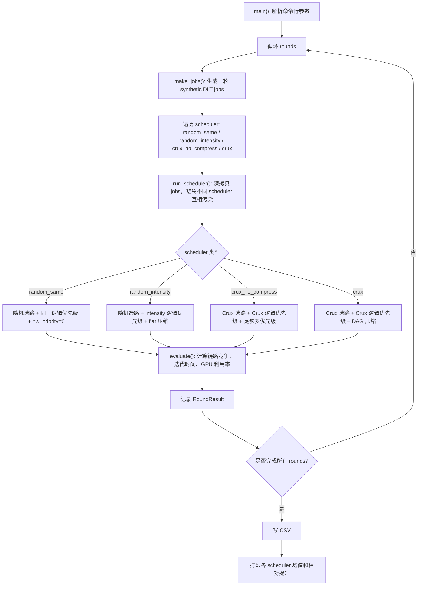

## 3. 代码结构

| 模块 | 主要函数/类 | 职责 |
|---|---|---|
| 数据模型 | `Job`, `RoundResult` | 描述作业和一轮评估结果 |
| 拓扑/路径 | `edge`, `build_candidate_paths` | 构造主机间候选 ECMP 路径 |
| workload 生成 | `make_jobs` | 生成 synthetic DLT jobs |
| 路径选择 | `assign_random_paths`, `assign_crux_paths` | 为每个作业选择通信路径 |
| 优先级分配 | `assign_logical_priorities` | 计算逻辑优先级 |
| 优先级压缩 | `contention_dag`, `random_topological_order`, `best_sequence_cut`, `compress_priorities`, `flat_compress_priorities` | 把逻辑优先级映射到有限硬件优先级 |
| 评估模型 | `evaluate` | 计算通信竞争、iteration time、GPU util |
| 实验驱动 | `run_scheduler`, `main` | 调度器对比、结果写入和打印 |

## 4. 数据模型

### 4.1 `Job`

`Job` 表示一个深度学习训练任务。

关键字段：

| 字段 | 含义 |
|---|---|
| `jid` | 作业 ID |
| `model` | 模型类型，如 ResNet/BERT/GPT/GPT-large |
| `gpu_count` | 作业使用 GPU 数 |
| `hosts` | 作业分布在哪些 host 上 |
| `compute_work` | 有效 GPU 计算工作量 |
| `base_compute_time` | 无竞争情况下的计算时间 |
| `base_comm_time` | 无竞争情况下的通信时间 |
| `overlap_ratio` | 计算和通信可重叠比例 |
| `traffic` | 通信流量权重 |
| `candidate_paths` | 候选通信路径 |
| `selected_path` | 调度器选中的路径 |
| `intensity` | GPU intensity，越高表示 GPU 空转代价越大 |
| `logical_priority` | 调度器计算出的逻辑优先级 |
| `hw_priority` | 压缩后的硬件优先级 |

`sensitivity` 是一个派生属性：

```python
sensitivity = max(0.05, 1.0 - overlap_ratio)
```

含义：通信延迟有多少比例无法被计算覆盖。`overlap_ratio` 越高，通信越容易被隐藏，`sensitivity` 越低。

### 4.2 `RoundResult`

`RoundResult` 记录一个 scheduler 在一轮 workload 上的结果：

| 字段 | 含义 |
|---|---|
| `round_id` | 第几轮实验 |
| `scheduler` | 调度器名称 |
| `gpu_util` | 集群 GPU 利用率 |
| `avg_iter_time` | 平均迭代时间 |
| `high_intensity_jct` | 高 intensity 作业平均迭代时间 |
| `low_intensity_jct` | 低 intensity 作业平均迭代时间 |

## 5. Workload 和路径建模

### 5.1 两种 workload 来源

当前模拟器支持两种 workload 来源：

| 模式 | 入口 | 数据来源 | 用途 |
|---|---|---|---|
| synthetic | `make_jobs` | 代码内置模型模板和随机 host placement | 快速理解机制、可控复现实验 |
| Lingjun trace | `make_lingjun_jobs` | 阿里云 Lingjun 开源 `job.csv`、`worker.csv`、`topo.csv` | 使用真实作业时间、host 放置、GPU 数和 Clos 拓扑做更真实的验证 |

Lingjun trace 模式通过 `--trace-data-dir` 启用：

```bash
/Users/dkwyl/.cache/codex-runtimes/codex-primary-runtime/dependencies/python/bin/python3 crux_repro/crux_sim.py \
  --seed 7 \
  --jobs 36 \
  --rounds 30 \
  --trace-data-dir data/lingjun \
  --out crux_repro/results/crux_lingjun_results.csv
```

### 5.2 生成 synthetic jobs

`make_jobs(seed, count, hosts, aggs)` 会根据固定模板生成作业：

| 模型 | GPU 数 | 计算时间 | 通信时间 | overlap | work scale |
|---|---:|---:|---:|---:|---:|
| ResNet | 4 | 0.85 | 0.22 | 0.72 | 1.0 |
| BERT | 8 | 1.20 | 0.45 | 0.48 | 2.7 |
| GPT | 16 | 1.80 | 0.95 | 0.28 | 7.2 |
| GPT-large | 32 | 2.30 | 1.55 | 0.18 | 14.0 |

生成时会加入随机扰动：

- 模型按权重抽样；
- 根据 GPU 数推导需要多少 host；
- 有一定概率把 host 打散，制造 aggregation link 竞争；
- 对 compute、comm、traffic、overlap 加 jitter；
- 计算 `intensity = compute_work / base_comm_time`。

### 5.3 读取 Lingjun trace

`read_lingjun_trace(data_dir)` 读取三类 CSV：

| 文件 | 使用字段 | 作用 |
|---|---|---|
| `job.csv` | `job_name`, `model`, `gmt_job_running`, `gmt_job_finished`, `gmt_job_stopped` | 获取作业模型名和运行时间窗口 |
| `worker.csv` | `job_name`, `host_ip`, `RES` | 获取作业 worker 放在哪些 host 上，以及每个 worker 申请的 GPU 数 |
| `topo.csv` | `ip`, `ASW`, `PSW`, `DSW` | 获取 host 在三层 Clos 网络中的位置 |

trace job 转换流程：

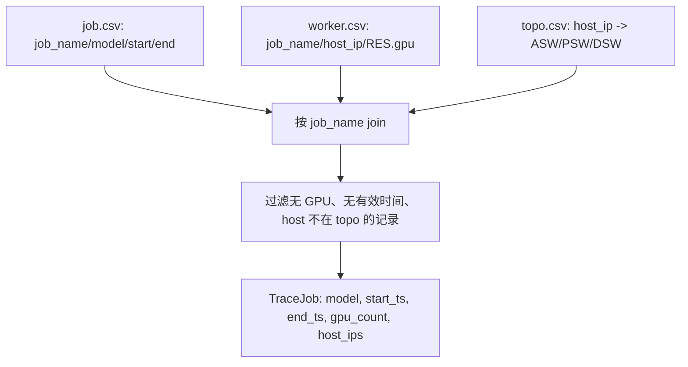

`make_lingjun_jobs` 会随机选择一个真实作业 start time 作为 snapshot，然后取当时正在运行的作业作为一轮并发 workload。这样保留了真实 trace 里的时间重叠关系和 host 放置关系。

需要注意：Lingjun 数据集没有提供 batch size、tensor size、NCCL collective 类型、每轮 iteration time 等训练超参。因此 trace 模式只把“作业何时运行、占多少 GPU、放在哪些 host、处于什么网络拓扑位置”替换为真实数据；计算/通信参数仍由模型名和 GPU 数近似推导。

### 5.4 候选路径

`build_candidate_paths(hosts, aggs)` 构造作业主导通信的候选路径。

单机作业：


跨主机作业：

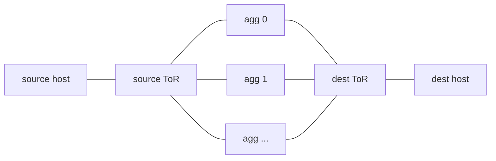

每个 aggregation switch 对应一条候选 ECMP 路径。

Lingjun trace 模式下使用 `build_trace_candidate_paths`，路径标签来自真实 `topo.csv`：


如果两个 host 在同一个 ASW 或 PSW 下，路径会自动缩短，不强行绕到 DSW。

## 6. 四种 scheduler 的设计

### 6.1 `random_same`

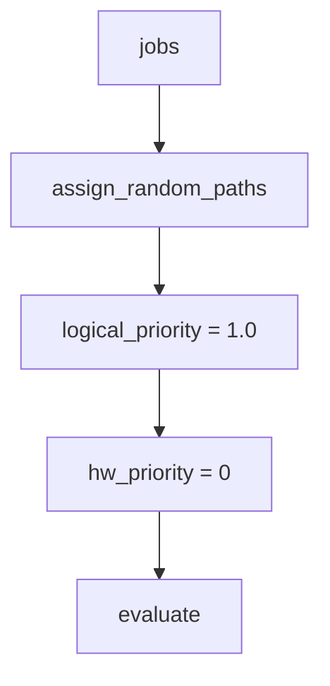

含义：随机 ECMP，所有流量同一优先级。它是最弱 baseline。

### 6.2 `random_intensity`

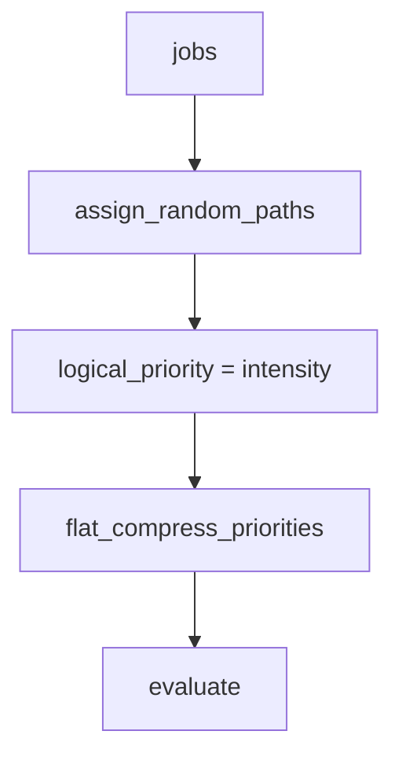

含义：路径仍然随机，但高 GPU-intensity 作业获得更高优先级。它验证“只做优先级，不做路径选择”能带来多少收益。

### 6.3 `crux_no_compress`

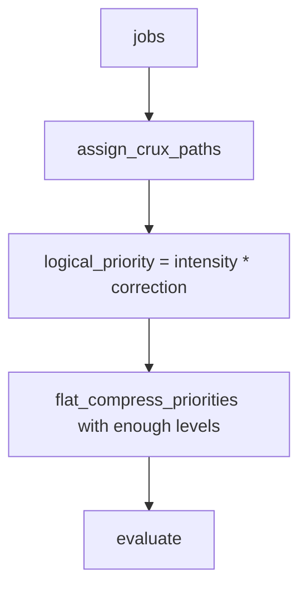

含义：使用 Crux 风格选路和优先级，但不受硬件优先级数量限制。它近似表示理想逻辑优先级效果。

### 6.4 `crux`

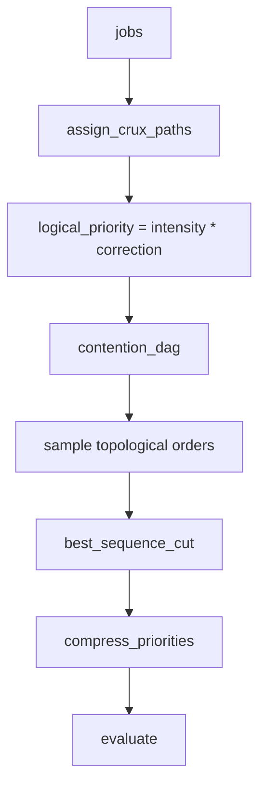

含义：完整 Crux 风格流程。它同时考虑路径竞争、通信敏感度和有限硬件优先级。

## 7. Crux 关键算法说明

### 7.1 GPU-intensity-aware path selection

对应函数：`assign_crux_paths`

核心逻辑：

1. 按 `job.intensity` 从高到低排序；
2. 对每个作业，遍历候选路径；
3. 选择当前累计 link load 最低的路径；
4. 被选路径上的每条 link 增加负载：

```python
link_load[link] += job.traffic * job.intensity
```

流程图：

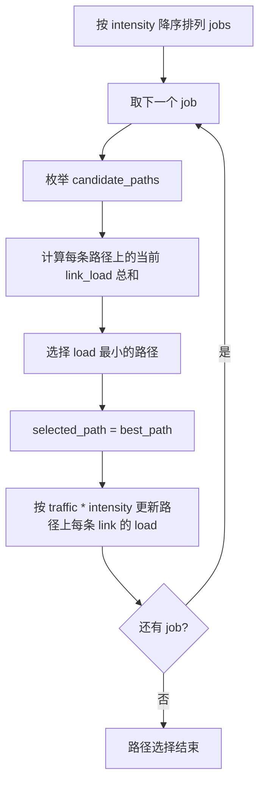

设计意图：高 intensity 作业更怕通信阻塞，因此先为它们抢占低竞争路径。

### 7.2 逻辑优先级分配

对应函数：`assign_logical_priorities`

三种模式：

| mode | 公式 | 含义 |
|---|---|---|
| `same` | `1.0` | 所有作业相同优先级 |
| `intensity` | `job.intensity` | GPU intensity 越高优先级越高 |
| `crux` | `intensity * correction` | 同时考虑 intensity 和通信敏感度 |

Crux 模式中的近似校正因子：

```python
correction = sensitivity * (1.0 + 1.0 / (base_compute_time + base_comm_time))
logical_priority = intensity * correction
```

这里的 `sensitivity = 1 - overlap_ratio`。通信越难被计算隐藏，优先级越应该提高。

### 7.3 通信竞争 DAG

对应函数：`contention_dag`

建图规则：

1. 每个 job 是一个节点；
2. 如果两个 job 的 `selected_path` 有公共 link，说明它们可能竞争；
3. 逻辑优先级更高的 job 指向逻辑优先级更低的 job；
4. 边权重取高优先级 job 的 `intensity`。

示意图：

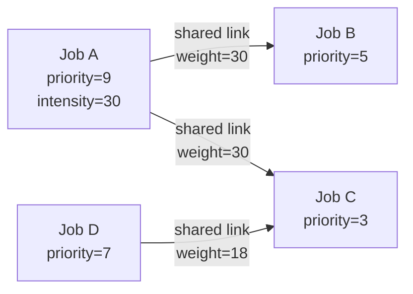

设计意图：压缩硬件优先级时，尽量保留重要的竞争关系，让高 intensity 作业不要和会影响它的低优先级作业落在同一个硬件优先级里。

### 7.4 DAG-based priority compression

对应函数：`compress_priorities`

硬件优先级数量有限，例如默认 `--priority-levels 4`。如果逻辑优先级数量大于硬件级别，就需要压缩。

核心步骤：

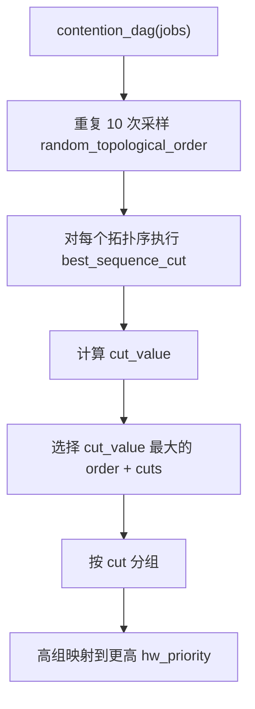

`best_sequence_cut(order, k, dag)` 的目标是在拓扑序上切出 `k` 段，使跨段保留下来的有向竞争边权重最大。

`cut_value` 的含义：

```python
if group[u] < group[v]:
    total += edge_weight(u, v)
```

也就是说，如果高优先级节点 `u` 和低优先级节点 `v` 被切到不同硬件优先级组，就认为这条重要竞争关系被保留下来。

## 8. 评估模型

对应函数：`evaluate`

评估过程：

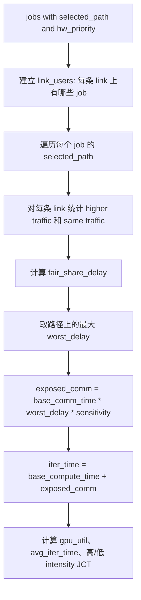

### 8.1 链路竞争模型

对于某个 job，在每条 link 上计算：

```python
higher = sum(u.traffic for u in users if u.hw_priority > job.hw_priority)
same = sum(u.traffic for u in users if u.hw_priority == job.hw_priority)
fair_share_delay = higher / job.traffic + same / job.traffic
```

解释：

- 更高优先级流量会压制当前 job；
- 同优先级流量需要公平分享带宽；
- 取路径中最差 link 作为通信放大因子。

### 8.2 迭代时间模型

```python
exposed_comm = base_comm_time * worst_delay * sensitivity
iter_time = base_compute_time + exposed_comm
```

解释：

- `base_comm_time` 是无竞争通信时间；
- `worst_delay` 表示竞争导致通信被放大；
- `sensitivity` 表示这部分通信延迟有多少无法被计算隐藏；
- 最终迭代时间等于计算时间加暴露通信时间。

### 8.3 GPU 利用率模型

```python
allocated_gpus = sum(j.gpu_count for j in jobs)
useful = sum(j.gpu_count * j.base_compute_time / iter_time[j.jid] for j in jobs)
gpu_util = useful / allocated_gpus
```

直觉：如果通信竞争导致 `iter_time` 变长，而 `base_compute_time` 不变，那么 GPU 做有效计算的占比下降，利用率降低。

## 9. 输出结果

运行完成后会生成：

```text
crux_repro/results/crux_sim_results.csv
```

CSV 字段：

| 字段 | 含义 |
|---|---|
| `round` | 实验轮次 |
| `scheduler` | 调度器名称 |
| `gpu_util` | GPU 利用率 |
| `avg_iter_time` | 平均迭代时间 |
| `high_intensity_jct` | 高 intensity 作业平均迭代时间 |
| `low_intensity_jct` | 低 intensity 作业平均迭代时间 |

终端会打印每个 scheduler 的均值和相对 `random_same` 的 GPU util 提升。

本地使用 Lingjun trace 模式运行 30 轮后的结果文件：

```text
crux_repro/results/crux_lingjun_results.csv
```

结果摘要：

| scheduler | GPU util | avg iter | high intensity JCT | low intensity JCT | 相对 random_same |
|---|---:|---:|---:|---:|---:|
| `random_same` | 0.6686 | 4.8736 | 8.0818 | 1.7497 | 0.00% |
| `random_intensity` | 0.6798 | 4.7812 | 7.8634 | 1.7497 | +1.68% |
| `crux_no_compress` | 0.6909 | 4.6280 | 7.6721 | 1.6876 | +3.33% |
| `crux` | 0.6908 | 4.6295 | 7.6721 | 1.6904 | +3.32% |

解释：在使用真实 trace 的 host 放置和并发窗口后，Crux 风格路径选择 + 优先级压缩仍然优于随机路径 baseline；`crux` 与 `crux_no_compress` 很接近，说明在这组参数和 4 个硬件优先级下，DAG 压缩保留了主要竞争关系。

## 10. 设计边界和简化点

这个模拟器有意做了简化：

1. trace 模式使用真实 job/worker/topology，但仍需要假设 compute/communication workload；
2. 只建模主导通信路径，不模拟完整 all-reduce 流量矩阵；
3. 不模拟真实 NCCL Ring/Tree、chunk、channel 和协议细节；
4. 不模拟真实交换机队列、RoCE PFC/ECN、PCIe arbitration；
5. 不模拟完整作业生命周期，只比较 snapshot 并发 workload 的稳态 iteration time；
6. `best_sequence_cut` 使用穷举切分，因为本地 job 数较小；论文中可用动态规划优化。

这些简化让代码更容易读，也让机制更清楚，但结果只能作为定性趋势参考。

## 11. 后续扩展建议

### 11.1 替换 workload

可以把 `make_jobs` 替换成真实 trace loader：


需要补齐字段：

- `gpu_count`
- `hosts`
- `base_compute_time`
- `base_comm_time`
- `overlap_ratio`
- `traffic`

### 11.2 加入 NCCL 参数

可以把 `base_comm_time` 拆成：

- collective 类型；
- message size；
- Ring/Tree algorithm；
- Simple/LL/LL128 protocol；
- intra-node/inter-node transport。

这样能和 NCCL 论文/PPT 的机制连起来。

### 11.3 更真实的网络模型

可以在 `evaluate` 中替换当前的 fair-share delay：

- 区分 ToR-agg、host-ToR、PCIe link；
- 加入链路带宽；
- 加入队列优先级；
- 加入 ECN/PFC 影响；
- 加入 NIC/host 限速。

### 11.4 更真实的硬件优先级压缩

当前 `hw_priority` 是抽象整数。真实部署中可以映射到：

- RoCEv2 traffic class；
- DSCP；
- switch priority queue；
- PCIe semaphore 或本地调度机制。

## 12. 团队沟通口径

可以用下面这段话向同事解释本模拟器：

> 这份代码不是为了复现 Crux 的生产环境数值，而是把 Crux 的核心思想做成一个可读、可跑的离线模拟器。它先生成一批 synthetic DLT 作业，再分别跑四种调度策略。Crux 策略会优先为高 GPU-intensity 作业选择低竞争路径，再根据通信暴露程度分配逻辑优先级，最后通过竞争 DAG 把逻辑优先级压缩到有限硬件优先级。评估时，代码用链路共享和优先级关系估算通信放大，再换算成 iteration time 和 GPU utilization。这个模型适合解释机制和比较趋势，不适合宣称和论文实验数值一致。
