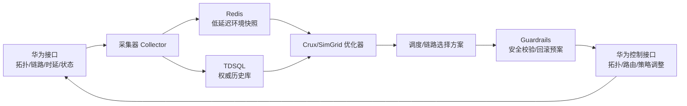
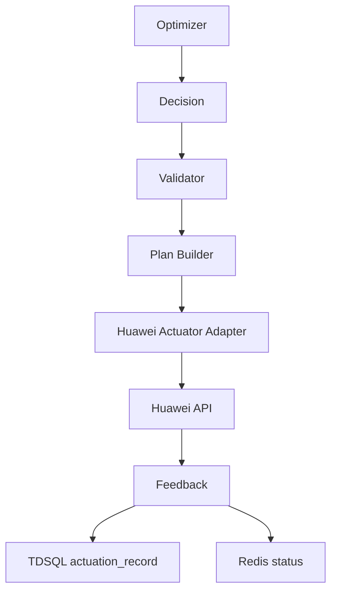

# 实机环境拓扑与网络时延接入方案

本文档用于把当前 SimGrid/Crux 模拟推进到实机闭环：从华为侧接口获取真实网络拓扑和链路时延，把环境信息落到本地 TDSQL/Redis，优化器从本地数据读取环境视图，计算调度/链路选择方案，再通过华为接口调整物理网络拓扑或路由策略。

## 1. 目标

当前 SimGrid 模型已经能表达多机多卡 collective 通信竞争，但拓扑、链路带宽、链路时延仍是简化参数。下一步要解决两个问题：

1. 优化器看到的拓扑必须接近真实环境；
2. 优化器输出的链路选择或拓扑调整方案必须能落到华为侧控制接口。

因此需要构建一条数据闭环：



## 2. 数据来源：华为接口

接口待定，但建议按能力拆成四类。

| 类别 | 数据 | 用途 |
|---|---|---|
| 资源拓扑 | 服务器、NPU/GPU、NIC、交换机、端口、链路 | 构建 SimGrid host/link/route |
| 时延/带宽 | link latency、effective bandwidth、loss/error、拥塞状态 | 校准通信模型和路径代价 |
| 实时状态 | 端口 up/down、链路利用率、队列长度、ECN/PFC 计数 | 优化器避开拥塞和故障链路 |
| 控制能力 | path steering、路由策略、端口/队列策略、拓扑调整 | 执行链路选择或拓扑调整方案 |

需要和华为侧确认的问题：

- 是否能查询每台服务器的 NPU/NIC/交换机端口绑定关系；
- 是否能拿到多层网络拓扑，例如 ToR/Leaf/Spine/Core；
- 链路时延是主动探测值、设备统计值，还是控制面估算值；
- 可调整的是物理拓扑、路由策略、ECMP hash、ACL/策略路由，还是队列/TC 参数；
- 控制接口的生效延迟、失败返回、回滚能力和权限边界；
- 接口调用频率限制，以及是否支持批量查询/批量下发。

## 3. 本地存储设计

### 3.1 TDSQL：权威历史库

TDSQL 负责保存可追溯、可审计的环境数据和优化决策。它适合做历史分析、回放、离线校准和问题追责。

建议表：

| 表 | 说明 |
|---|---|
| `hw_node` | 服务器、交换机、NPU/GPU/NIC 等节点 |
| `hw_port` | 端口、端口速率、端口状态 |
| `hw_link` | 物理链路，包含 src/dst node/port、带宽、链路类型 |
| `hw_route_candidate` | 候选路径，记录经过的 link 序列 |
| `net_metric_snapshot` | 周期性链路指标快照，如时延、利用率、丢包、ECN/PFC |
| `optimizer_input_snapshot` | 优化器使用的环境快照版本 |
| `optimizer_decision` | 优化器输出的 placement/path/priority 方案 |
| `actuation_record` | 下发华为接口的操作、结果、失败原因、回滚状态 |

核心字段建议：

```text
snapshot_id
cluster_id
node_id
node_type
device_model
port_id
link_id
src_node_id
dst_node_id
bandwidth_bps
latency_us
utilization
loss_rate
ecn_count
pfc_count
status
observed_at
source_api
confidence
```

### 3.2 Redis：优化器在线快照

Redis 负责给优化器提供低延迟读取。优化器不应该每次直接打华为接口，也不应该在线扫 TDSQL 大表。

建议 key 设计：

| Key | Value | TTL |
|---|---|---|
| `topo:{cluster_id}:current` | 当前拓扑版本号和摘要 | 长 TTL |
| `topo:{cluster_id}:nodes` | node 列表 JSON/MsgPack | 长 TTL |
| `topo:{cluster_id}:links` | link 列表 JSON/MsgPack | 长 TTL |
| `topo:{cluster_id}:routes` | 候选路径集合 | 长 TTL |
| `metric:{cluster_id}:links` | 最新链路时延/利用率/状态 | 短 TTL |
| `snapshot:{snapshot_id}` | 优化器输入快照 | 长 TTL |
| `decision:{decision_id}` | 优化器输出方案 | 长 TTL |

Redis 中建议保存两类视图：

1. 当前视图：优化器在线使用；
2. 固化快照：某次优化决策使用的完整输入，便于复盘。

## 4. 优化器读取方式

优化器运行时只读本地环境信息：

```text
Redis current snapshot
  -> 缺失或过期时读取 TDSQL 最近稳定快照
  -> 仍不可用时降级到静态配置
```

优化器输入应包含：

- 当前可用 host/card；
- host 到 NPU/GPU/NIC 的绑定关系；
- host-to-host 候选路径；
- 每条 link 的带宽、时延、利用率、状态；
- 每条 path 的聚合代价；
- 当前 job/workload 的 placement 约束；
- 可执行的控制动作列表。

路径代价建议：

```text
path_cost =
  alpha * sum(link_latency_us)
  + beta * max(link_utilization)
  + gamma * sum(queue_or_pfc_penalty)
  + delta * failure_or_degraded_penalty
```

对于训练 collective，可以再乘以 job 的通信敏感度：

```text
weighted_path_cost =
  path_cost * communication_sensitivity * gpu_intensity
```

## 5. 华为控制接口执行方式

用户提到“网络链路选择通过华为接口调整物理网络拓扑，具体接口待定”。在接口未确定前，建议把执行层抽象成 `Actuator`，不要让优化器直接耦合某个具体接口。



建议控制动作模型：

| 动作 | 说明 | 风险 |
|---|---|---|
| `set_path_preference` | 调整某些 job/flow 的候选路径偏好 | 中 |
| `update_route_policy` | 修改路由策略或策略路由 | 高 |
| `update_ecmp_weight` | 调整 ECMP 权重或 hash 相关参数 | 中/高 |
| `update_traffic_class` | 调整队列/TC/优先级映射 | 中 |
| `disable_degraded_link` | 避开降级链路 | 高 |
| `rollback_decision` | 回滚上一次调整 | 必须支持 |

上线前必须加保护：

- dry-run 模式；
- 只读模拟模式；
- 小流量/白名单 job 试点；
- 变更前后拓扑一致性检查；
- 超时自动回滚；
- 决策幂等 id；
- 每次下发写入 `actuation_record`；
- 操作权限隔离，避免优化器直接拥有高危接口权限。

## 6. 与 SimGrid 的关系

真实拓扑数据有两种用途：

1. 生成 SimGrid platform：
   - `hw_node` -> host/switch/netzone；
   - `hw_link` -> link；
   - `hw_route_candidate` -> route；
   - `net_metric_snapshot` -> bandwidth/latency/factor。

2. 作为在线优化器输入：
   - 当前链路状态；
   - 候选路径代价；
   - 拥塞和故障标记；
   - 可调整路径集合。

建议新增一个拓扑导出层：

```text
TDSQL/Redis topology snapshot
  -> topology_normalizer
  -> cluster_config.yaml
  -> SimGrid platform builder
```

这样 SimGrid 和在线优化器共享同一个“环境事实源”，避免模拟配置和线上配置分叉。

## 7. 推荐落地阶段

### 阶段 1：只读采集

目标：先打通华为接口到本地环境快照，不做任何控制。

产出：

- Collector；
- TDSQL 表；
- Redis current snapshot；
- 拓扑快照导出；
- 数据质量报告。

验收：

- 能稳定获取服务器/NPU/NIC/交换机/链路关系；
- 能获取链路时延和状态；
- 能按 snapshot_id 复现某一时刻拓扑。

### 阶段 2：SimGrid 校准

目标：用真实拓扑生成 SimGrid platform，替换当前简化拓扑。

产出：

- `cluster_config.yaml`；
- platform builder；
- SimGrid platform diff 工具；
- 与 HCCL benchmark 的误差报告。

验收：

- 单 job collective 模拟结果能和 HCCL benchmark 对齐到可解释范围；
- 能定位某次通信慢是由哪条链路或哪类路径导致。

### 阶段 3：只读优化建议

目标：优化器只输出建议，不下发华为接口。

产出：

- placement/path/priority 建议；
- 预计收益；
- 风险标记；
- 对比当前策略的 SimGrid replay。

验收：

- 能对历史窗口 replay，验证建议收益；
- 能解释建议为什么选择某条路径或某组 host。

### 阶段 4：小范围闭环控制

目标：通过华为接口对小范围白名单 job 或测试集群下发调整。

产出：

- actuator adapter；
- dry-run / apply / rollback；
- actuation audit；
- 线上前后对比报告。

验收：

- 控制动作可回滚；
- 不影响非白名单业务；
- 实测收益方向与 SimGrid 预测一致。

## 8. 当前需要补充的接口清单

接口待定前，建议先向华为侧确认这些能力：

```text
GET /clusters/{id}/nodes
GET /clusters/{id}/devices
GET /clusters/{id}/ports
GET /clusters/{id}/links
GET /clusters/{id}/routes/candidates
GET /clusters/{id}/metrics/links
POST /clusters/{id}/route-policies/dry-run
POST /clusters/{id}/route-policies/apply
POST /clusters/{id}/route-policies/rollback
GET /clusters/{id}/actions/{action_id}
```

这些只是能力占位，不代表真实接口路径。真实接口确定后，应在 adapter 层做映射。

## 9. 关键风险

| 风险 | 说明 | 缓解 |
|---|---|---|
| 拓扑数据不完整 | 缺少端口/NIC/链路绑定会导致路径计算错误 | 数据质量评分，缺失时降级 |
| 时延数据波动 | 瞬时探测值可能误导优化器 | 多窗口平滑，置信度字段 |
| 控制接口风险高 | 路由/拓扑调整可能影响非目标业务 | 白名单、dry-run、回滚、限流 |
| 模拟和线上不一致 | SimGrid 预测不等于真实 HCCL 行为 | HCCL benchmark 校准 |
| 存储视图过期 | Redis 快照过期会导致错误决策 | TTL、snapshot version、fallback |

## 10. 与后续优化路线的关系

这部分对应 `SIMGRID_COLLECTIVE_SIMULATION_PLAN.zh-CN.md` 中的：

- 11.1 拓扑从“可跑”升级到“可校准”；
- 11.2 HCCL benchmark 校准；
- 11.3 path selection / priority / compression；
- 11.5 背景流和扰动场景；
- 11.6 可解释指标和链路利用率可视化。

优先级建议：先做只读采集和本地快照，再做 SimGrid platform 生成；控制接口闭环放到最后，必须等 dry-run、审计、回滚机制完整后再接入。
