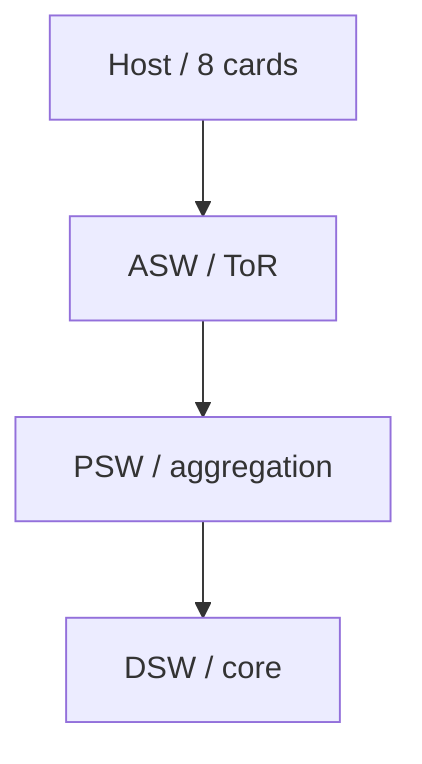
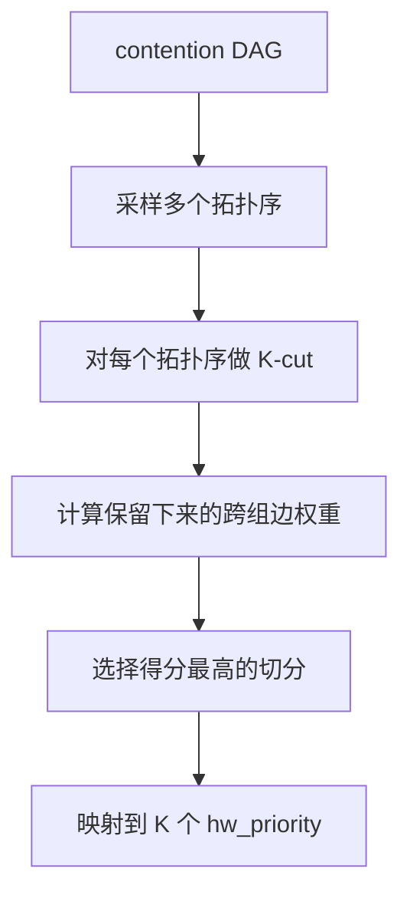

# SimGrid 多机多卡 Collective 通信竞争模拟方案

## 0. 当前落地状态

本地 SimGrid 环境已经配置完成，并补充了一个真实链接 SimGrid S4U/C++ runtime 的多机多卡 collective 竞争模拟：

```text
/Users/dkwyl/Documents/tmbProject/net/.simgrid_install
/Users/dkwyl/Documents/tmbProject/net/crux_repro/simgrid_real
```

环境说明：

| 项 | 状态 |
|---|---|
| SimGrid C++/S4U | 已从 `simgrid-4.1` 源码编译安装 |
| Boost/CMake/Ninja | 已放在 `.simgrid_env` |
| Python binding | 当前 macOS arm64 环境存在 pybind11 property/call_guard 编译兼容问题，暂不使用 |
| 模拟入口 | `crux_repro/simgrid_real/collective_sim.cpp` |
| 批量运行脚本 | `crux_repro/simgrid_real/run_all.sh` |
| 结果文件 | `crux_repro/results/simgrid_real_collective_results.csv` |
| trace workload | `crux_repro/results/simgrid_trace_workload.csv` |
| trace replay 结果 | `crux_repro/results/simgrid_real_trace_replay_results.csv` |
| trace optimize 结果 | `crux_repro/results/simgrid_real_trace_optimize_balanced_results.csv` |
| trace optimize job 结果 | `crux_repro/results/simgrid_real_trace_optimize_balanced_jobs.csv` |
| trace optimize 报告 | `crux_repro/results/simgrid_real_trace_optimize_balanced_report.md` |
| job-level 分析 | `crux_repro/results/job_analysis/crux_no_compress_vs_random_same_job_analysis.md` |
| DeepSeek 验证图表 | `crux_repro/results/verification/figures/README.zh-CN.md` |

构建命令：

```bash
cd /Users/dkwyl/Documents/tmbProject/net
MAMBA_ROOT_PREFIX=/Users/dkwyl/Documents/tmbProject/net/.mamba \
  /Users/dkwyl/Documents/tmbProject/net/.tools/micromamba/bin/micromamba run \
  -p /Users/dkwyl/Documents/tmbProject/net/.simgrid_env \
  /Users/dkwyl/Documents/tmbProject/net/crux_repro/simgrid_real/build.sh
```

运行命令：

```bash
cd /Users/dkwyl/Documents/tmbProject/net
DYLD_LIBRARY_PATH=/Users/dkwyl/Documents/tmbProject/net/.simgrid_install/lib:/Users/dkwyl/Documents/tmbProject/net/.simgrid_env/lib \
  /Users/dkwyl/Documents/tmbProject/net/crux_repro/simgrid_real/run_all.sh
```

本轮真实 SimGrid 结果：

| scheduler | makespan(s) | avg JCT(s) | avg comm(s) | useful GPU fraction |
|---|---:|---:|---:|---:|
| `random_same` | 107.579 | 75.983 | 72.603 | 0.0768 |
| `random_intensity` | 107.579 | 75.983 | 72.605 | 0.0768 |
| `crux_no_compress` | 42.550 | 33.353 | 28.113 | 0.1942 |
| `crux` | 42.550 | 33.353 | 28.113 | 0.1942 |

相对 `random_same`：

- `crux_no_compress` / `crux` makespan 降低约 60.45%；
- 平均 job completion time 降低约 56.11%；
- useful GPU fraction 相对提升约 152.83%。

这个结果不是论文精确复现，而是一个机制验证：当高通信强度 job 的 rank 被收敛到更少物理机时，Ring AllReduce 跨机路径显著减少，共享 NIC/core 链路的竞争下降，训练等待时间明显改善。当前 `crux` 与 `crux_no_compress` 结果一致，说明在这个小规模场景里，主要收益来自拓扑感知放置；限速/优先级没有进一步改变瓶颈，后续需要引入更强的低优先级背景流量或更接近硬件 TC 的服务模型来验证 priority compression。

Trace-driven 模式也已补充。它先用 `make_trace_workload.py` 从 Lingjun `job.csv`、`worker.csv`、`topo.csv` 生成 workload CSV，再用 `run_trace.sh` 运行真实 SimGrid，最后用 `report_results.py` 生成报告。

Trace-driven replay 结果：

| scheduler | makespan(s) | avg JCT(s) | avg comm(s) | useful GPU fraction |
|---|---:|---:|---:|---:|
| `random_same` | 225.703 | 96.898 | 67.945 | 0.1980 |
| `random_intensity` | 225.733 | 96.956 | 68.010 | 0.1980 |
| `crux_no_compress` | 225.703 | 96.898 | 67.945 | 0.1980 |
| `crux` | 225.657 | 97.152 | 68.183 | 0.1981 |

解释：trace-driven replay 模式保留生产轨迹中的 host placement，Crux 不重新放置 job，因此结果主要验证“真实到达窗口 + 真实 host 分布 + priority/rate 策略”。

`placement_mode=optimize` 已补充。它保留 trace 的作业到达时间、模型参数和 GPU/rank 数，但允许调度器重新选择 rank placement，用于观察 Crux 重排收益。当前推荐搭配 `placement_objective=balanced`，同时考虑 host 负载和 GPU slot 负载，并用当前 workload 的 intensity 中位数动态区分高/低通信任务。

Trace-driven optimize 结果：

| scheduler | makespan(s) | avg JCT(s) | avg comm(s) | useful GPU fraction |
|---|---:|---:|---:|---:|
| `random_same` | 95.305 | 52.952 | 31.637 | 0.4689 |
| `random_intensity` | 94.997 | 52.844 | 31.538 | 0.4705 |
| `crux_no_compress` | 83.171 | 44.970 | 22.124 | 0.5374 |
| `crux` | 83.985 | 45.074 | 22.291 | 0.5322 |

解释：开启 balanced 重排后，Crux-style placement 在 makespan 上相对 `random_same` 改善约 12.73%，平均 JCT 改善约 15.07%，平均通信时间改善约 30.07%，useful GPU fraction 从 0.4689 提升到 0.5374。

Job-level 分析也已生成：

- `crux_repro/results/job_analysis/crux_no_compress_vs_random_same_job_analysis.md`
- `crux_repro/results/job_analysis/crux_no_compress_vs_random_same_job_deltas.csv`
- `crux_repro/results/job_analysis/jct_cdf.svg`
- `crux_repro/results/job_analysis/crux_no_compress_jct_delta.svg`

当前 12 个 trace job 中，10 个 JCT 改善，2 个 JCT 退化。Top gain 是 `GPT-large` job 4，JCT 降低 23.404s，通信时间降低 29.138s。两个退化 job 的通信时间也下降，但 JCT 变差，说明后续 objective 还需要继续加入 job fairness 或 rank 启动/算力拥塞约束。

本文档面向内部讨论，目标是说明如何用 SimGrid 建模多机多卡训练集群中的 collective 通信竞争，并验证 Crux 论文中的核心思想：

1. 感知 GPU intensity 的路径选择；
2. 感知通信敏感度的优先级分配；
3. 将逻辑优先级压缩到有限硬件优先级。

当前实机环境是昇腾 920 + 910B。本文档暂时不模拟 HCCL/NCCL/RoCE/PCIe semaphore 的真实协议细节，而是把问题抽象为：

> 多个训练作业在多机多卡集群上并发运行，collective 通信共享网络链路，调度器如何选择通信路径和优先级，从而降低高价值 GPU 作业的等待时间。

## 1. SimGrid 使用边界

SimGrid 官方手册把它定位为分布式系统仿真工具。它通过 platform 描述 host、link、route 等资源，用 actor 表示应用逻辑，用 activity 表示计算、通信、I/O 等事件。

本地同时保留了一个 **SimGrid-style 离散事件仿真器**：

```text
crux_repro/simgrid_collective_sim.py
```

它没有直接 import `simgrid`，但对象和迁移接口按 SimGrid S4U 思路组织：

| 当前仿真对象 | SimGrid 对应概念 |
|---|---|
| `Cluster` | platform.xml 中的 host/link/route |
| `TrainJob` | actor 内部的训练任务状态 |
| compute phase | `Actor::execute(flops)` |
| `Flow` | mailbox send/recv 或通信 activity |
| link bandwidth sharing | SimGrid network sharing model |
| Ring AllReduce step | 一批 actor 间 point-to-point communications |

它适合快速调参和复现 Crux 抽象算法；真实 SimGrid S4U/C++ 版本则用于验证 actor、host、link、route 资源共享下的运行时行为。

## 2. 建模目标

第一阶段只验证训练过程优化，不涉及推理。

建模目标：

- 多机多卡集群；
- 多个训练 job 并发；
- 每个 job 有 compute phase 和 collective communication phase；
- collective 先支持 Ring AllReduce；
- 多个 collective flow 共享链路时发生通信竞争；
- 比较不同调度策略对 GPU util、iteration time、通信等待和高 GPU-intensity job 的影响。

不建模：

- HCCL/NCCL 的真实 kernel；
- RoCE PFC/ECN；
- 昇腾 HCCS/PCIe 细节；
- 实际 traffic class 队列行为；
- compute/communication overlap 的精细时序；
- 多轮训练中的动态到达和退出。

## 3. 集群模型

### 3.1 拓扑

模拟一个三层 Clos-like 网络：



默认参数：

| 参数 | 默认值 |
|---|---:|
| hosts | 16 |
| cards per host | 8 |
| ASW | 8 |
| PSW | 4 |
| DSW | 4 |
| host-ASW bandwidth | 200 Gbps |
| ASW-PSW bandwidth | 400 Gbps |
| PSW-DSW bandwidth | 800 Gbps |
| intra-host bandwidth | 600 Gbps |
| link latency | 8 us |

这些参数不是昇腾实机测量值，只是用于第一版机制验证。后续应替换成 920 + 910B 集群的真实拓扑和链路能力。

### 3.2 Path 建模

同机通信：

```text
hX:gpu <-> hX:pcie
```

同 ASW 跨 host：

```text
host -> ASW -> host
```

跨 PSW/DSW：

```text
host -> ASW -> PSW -> DSW -> PSW -> ASW -> host
```

Crux 的 path selection 当前选择的是 DSW ECMP 路径。这个抽象等价于“在多个核心层路径之间做源端 steering”。

## 4. 训练 Job 模型

每个 job 包含：

| 字段 | 含义 |
|---|---|
| `gpu_count` | 使用卡数 |
| `hosts` | job 分布在哪些 host |
| `compute_time` | 每轮有效计算时间 |
| `tensor_bytes` | AllReduce tensor 大小 |
| `overlap_ratio` | 通信可被计算隐藏的比例 |
| `intensity` | GPU intensity |
| `logical_priority` | 逻辑优先级 |
| `hw_priority` | 压缩后的硬件优先级 |
| `selected_dsw` | 选中的 DSW 路径 |

模型模板：

| 模型 | GPU 数 | compute time | tensor bytes | overlap |
|---|---:|---:|---:|---:|
| ResNet | 8 | 0.80s | 0.7 GiB | 0.70 |
| BERT | 16 | 1.20s | 1.6 GiB | 0.48 |
| GPT | 32 | 1.80s | 3.6 GiB | 0.30 |
| GPT-large | 64 | 2.60s | 7.5 GiB | 0.18 |

GPU intensity 近似为：

```text
intensity =
  gpu_count * compute_time
  / exposed_isolated_comm_time
```

其中：

```text
exposed_isolated_comm_time =
  isolated_ring_comm_time * sensitivity
```

```text
sensitivity = max(0.05, 1 - overlap_ratio)
```

## 5. Collective 模型

第一版只模拟 Ring AllReduce。

对于 `N` 张卡：

```text
Ring AllReduce = ReduceScatter + AllGather
step 数 = 2 * (N - 1)
每步每个 rank 向下一个 rank 发送一个 chunk
chunk_size = tensor_bytes / N
```

为了不显式模拟 overlap，当前只把不可隐藏的通信放到 critical path：

```text
exposed_chunk_size = tensor_bytes * sensitivity / N
```

每个 step 必须等该 step 的所有 rank-to-rank flow 完成后，才能进入下一 step。这对应 Ring AllReduce 的同步依赖。

## 6. 网络竞争模型

每个通信 flow 有：

```text
src_rank
dst_rank
remaining_bytes
path_links
hw_priority
```

每条 link 上的 active flows 共享带宽。

当前用加权公平共享近似硬件优先级：

```text
flow_weight = 1.0 + 0.5 * hw_priority
flow_rate_on_link =
  link_bandwidth * flow_weight / sum(active_flow_weights_on_link)
```

一个 flow 的实际速率取路径上所有 link 的最小可得速率：

```text
flow_rate = min(rate_on_each_link)
```

这不是 RoCE traffic class 的真实行为，但足以表达“高优先级通信在竞争链路上获得更多服务份额”。

## 7. Crux 策略映射

### 7.1 Baselines

模拟四种策略：

| scheduler | path selection | priority |
|---|---|---|
| `random_same` | 随机 DSW | 所有 job 同一优先级 |
| `random_intensity` | 随机 DSW | intensity 排序后压缩 |
| `crux_no_compress` | Crux path selection | Crux logical priority，近似无限优先级 |
| `crux` | Crux path selection | DAG 压缩到有限硬件优先级 |

### 7.2 Crux path selection

```text
按 intensity 从高到低遍历 job
枚举候选 DSW 路径
计算该路径上已有 weighted load
选择 load 最低路径
更新 link_load += tensor_bytes * intensity
```

目标：让 GPU intensity 高的 job 更少与彼此共享瓶颈链路。

### 7.3 Priority assignment

```text
logical_priority =
  intensity * sensitivity * (1 + 1 / compute_time)
```

直觉：

- intensity 高，阻塞代价大；
- sensitivity 高，通信更难被计算隐藏；
- compute iteration 短，通信延迟更容易影响整体 iteration。

### 7.4 Priority compression

构造 contention DAG：

```text
node = training job
edge = 两个 job 共享通信链路，且优先级不同
edge direction = higher priority -> lower priority
edge weight = higher priority job 的 intensity
```

压缩流程：



默认 `K = 4`。

## 8. 运行方式

脚本：

```text
crux_repro/simgrid_collective_sim.py
```

标准场景：

```bash
/Users/dkwyl/.cache/codex-runtimes/codex-primary-runtime/dependencies/python/bin/python3 crux_repro/simgrid_collective_sim.py \
  --seed 7 \
  --rounds 20 \
  --jobs 24 \
  --hosts 16 \
  --gpus-per-host 8 \
  --asw 8 \
  --psw 4 \
  --dsw 4 \
  --priority-levels 4 \
  --out crux_repro/results/simgrid_collective_results.csv
```

拥塞场景：

```bash
/Users/dkwyl/.cache/codex-runtimes/codex-primary-runtime/dependencies/python/bin/python3 crux_repro/simgrid_collective_sim.py \
  --seed 11 \
  --rounds 20 \
  --jobs 36 \
  --hosts 16 \
  --gpus-per-host 8 \
  --asw 8 \
  --psw 4 \
  --dsw 4 \
  --priority-levels 4 \
  --host-asw-gbps 100 \
  --asw-psw-gbps 160 \
  --psw-dsw-gbps 240 \
  --intra-host-gbps 400 \
  --out crux_repro/results/simgrid_collective_congested_results.csv
```

## 9. 模拟结果

### 9.1 标准场景

结果文件：

```text
crux_repro/results/simgrid_collective_results.csv
```

| scheduler | GPU util | avg iter | avg comm | high intensity JCT | low intensity JCT | util gain |
|---|---:|---:|---:|---:|---:|---:|
| `random_same` | 0.6936 | 1.8697 | 0.6000 | 1.0393 | 2.2474 | 0.00% |
| `random_intensity` | 0.6958 | 1.8615 | 0.5918 | 1.0167 | 2.3286 | +0.31% |
| `crux_no_compress` | 0.6934 | 1.8819 | 0.6121 | 1.0311 | 2.3625 | -0.03% |
| `crux` | 0.6937 | 1.8774 | 0.6077 | 1.0314 | 2.3180 | +0.01% |

观察：

- 总 GPU util 基本持平；
- intensity priority 对 high-intensity job 有保护，高强度 job JCT 从 1.0393 降到 1.0167；
- 当前 path selection 粒度只选择 DSW，无法缓解 host-ASW/ASW-PSW 上的不可避免竞争，因此 Crux 总收益不明显。

### 9.2 拥塞场景

结果文件：

```text
crux_repro/results/simgrid_collective_congested_results.csv
```

| scheduler | GPU util | avg iter | avg comm | high intensity JCT | low intensity JCT | util gain |
|---|---:|---:|---:|---:|---:|---:|
| `random_same` | 0.4796 | 3.0334 | 1.7504 | 1.1474 | 4.1295 | 0.00% |
| `random_intensity` | 0.4834 | 3.0347 | 1.7517 | 1.0977 | 4.6004 | +0.80% |
| `crux_no_compress` | 0.4710 | 3.2958 | 2.0129 | 1.1213 | 5.3985 | -1.80% |
| `crux` | 0.4779 | 3.1002 | 1.8172 | 1.1305 | 4.5727 | -0.36% |

观察：

- 拥塞场景下，优先级确实更明显地保护 high-intensity job；
- 但低 intensity job 的 JCT 会变差；
- 当前 Crux path selection 没有带来论文级收益，说明模型还缺关键机制或参数校准；
- DAG priority compression 比无限逻辑优先级更温和，避免了更严重的低优先级拖尾。

## 10. 当前结论

当前已经有两层验证：

1. `simgrid_collective_sim.py`：SimGrid-style 离散事件模型，便于快速迭代 Crux 抽象算法；
2. `simgrid_real/collective_sim.cpp`：真实 SimGrid S4U/C++ runtime，便于验证 host、link、route、actor、mailbox communication 下的链路共享行为。

真实 SimGrid 小规模实验的结论是：

> 当高通信强度 job 的 rank 被拓扑感知地收敛到更少物理机时，Ring AllReduce 跨机路径显著减少，共享 NIC/core 链路竞争下降，makespan 和平均 JCT 都明显改善。

这和 Crux 的核心思想一致：训练优化不能只看 job 本身，还要看通信强度、放置、路径共享和竞争链路。当前实验里 `crux` 与 `crux_no_compress` 结果一致，说明主要收益来自拓扑感知放置；优先级压缩还没有在这个小 workload 中形成额外收益。

当前限制：

1. 真实 SimGrid 版本先采用简化拓扑：每张卡是一个 host，同机共享 local link，跨机经过源 NIC、core、目的 NIC；
2. collective 只实现了 Ring AllReduce，未模拟 Tree/Hierarchical collective；
3. 没有使用真实昇腾 920 + 910B 拓扑和链路参数；
4. 没有模拟 HCCL 的实际通信计划；
5. 优先级用 SimGrid `Comm::set_rate()` 做近似限速，还不是硬件 traffic class；
6. 所有 job 同时开始，缺少生产环境中的到达/退出动态。

## 11. 后续改进路线

### 11.1 优化一：把拓扑从“可跑”升级到“可校准”

已完成：

- Boost/CMake/Ninja 依赖环境已配置在 `.simgrid_env`；
- SimGrid 4.1 已编译安装到 `.simgrid_install`；
- 已采用 C++ S4U 路线，绕开当前 macOS arm64 上 Python binding 的 pybind11 兼容问题；
- 已实现 rank actor、mailbox communication、SimGrid link sharing、Ring AllReduce step 依赖。

后续要深化的是模型粒度，而不是再“替换 runtime”：

| 当前实现 | 下一步 |
|---|---|
| C++ 代码内动态创建 platform | 支持从集群配置生成 platform，便于替换真实拓扑 |
| 每张卡一个 SimGrid host | 补充 host/socket/NIC/卡间互联层级 |
| Ring AllReduce | 增加 Tree、Hierarchical、ReduceScatter、AllGather |
| `Comm::set_rate()` 近似优先级 | 建模 traffic class、队列、限速和背景流 |
| 固定 job 同时启动 | 接入 trace start/end，支持动态到达和退出 |
| 内置合成 workload | 接入 Lingjun trace 与实测 HCCL benchmark 参数 |

已完成 trace-driven workload 的第一版：

- `make_trace_workload.py` 从 Lingjun `job.csv`、`worker.csv`、`topo.csv` 生成 workload CSV；
- workload 保留真实并发窗口、host 分布、GPU 规模和模型名；
- 缺失的 compute time、tensor size 由模型模板补齐；
- `collective_sim.cpp` 支持 `--workload-csv`，rank actor 会按 trace `start_s` 动态启动；
- `collective_sim.cpp` 支持 `--placement-mode replay|optimize`，可在原始放置和重排放置之间切换；
- `collective_sim.cpp` 支持 `--placement-objective throughput|balanced`，其中 balanced 会同时考虑 host 负载和 GPU slot 负载；
- `collective_sim.cpp` 支持 `--job-out` 输出 job-level timeline，方便定位 JCT/fairness 问题；
- `run_trace.sh` 批量运行四种 scheduler；
- `report_results.py` 生成 Markdown 对比报告。

当前真实 SimGrid 版本的拓扑是为了先跑通机制：每张卡是一个 host，同机通信共享 `localX`，跨机通信经过 `nicX -> core -> nicY`。这个模型能表达链路共享，但还不能回答“昇腾 920 + 910B 实机上收益是否可信”。

下一步要把拓扑拆成可校准层级：

| 层级 | 当前模型 | 下一步建模 |
|---|---|---|
| 卡 | 每卡一个 host | 保留每卡 host，并增加卡型号、算力、内存带宽参数 |
| 单机互联 | 一个 `localX` 链路 | 区分 HCCS/PCIe/NUMA/socket 内外路径 |
| NIC | 每机一个 NIC | 支持多 NIC、多 rail、host 到 NIC 的绑定关系 |
| ToR/Leaf | 暂时折叠进 core | 建出 ToR/Leaf 链路和 oversubscription |
| Spine/Core | 一个共享 core link | 支持多条 ECMP core path |
| 路由 | 简化全连接 route | 从配置生成 route，允许按 path candidate 做选择 |

需要采集的数据：

- 单机 8 卡实际互联图；
- 每张卡到每个 NIC 的亲和关系；
- NIC 数量、单 NIC 带宽、是否多 rail；
- ToR/Leaf/Spine 层级和 oversubscription；
- 同机、同 ToR、跨 ToR、跨 Spine 的延迟和有效带宽；
- 920 + 910B 混部时不同卡型间的计算能力差异。

交付目标：

- 新增 `cluster_config.yaml` 或类似配置；
- 由配置自动生成 SimGrid platform；
- 同一 workload 可以切换“简化拓扑”和“昇腾校准拓扑”；
- 输出每类链路的利用率、瓶颈链路和排队时间。

优先级：最高。拓扑可信度决定后续所有调度结论是否能和实机沟通。

实机拓扑和网络时延接入的独立工程方案见：

[实机环境拓扑与网络时延接入方案](REAL_ENV_TOPOLOGY_INTEGRATION.zh-CN.md)

该方案把数据闭环拆成：

```text
华为接口 -> Collector -> TDSQL/Redis -> 优化器 -> Guardrails -> 华为控制接口
```

其中 TDSQL 保存权威历史与审计记录，Redis 保存低延迟在线环境快照；优化器只读取本地数据，不在调度关键路径上直接调用华为接口。网络链路选择和拓扑调整通过华为 Actuator Adapter 执行，具体接口待定。

### 11.2 优化二：用 HCCL benchmark 校准 collective 通信模型

需要采集：

- 单机 8 卡拓扑；
- HCCS/PCIe/NIC 带宽；
- 跨机网络层级和带宽；
- host 到交换机连接方式；
- HCCL benchmark 的 AllReduce/ReduceScatter/AllGather 曲线；
- 多 job 并发时通信退化曲线。

当前 Ring AllReduce 是标准抽象：

```text
step = 2 * (rank_count - 1)
chunk = tensor_bytes / rank_count
rank i -> rank i+1
```

这个抽象适合解释 collective 竞争，但不一定贴近 HCCL 在不同规模、不同 message size、不同拓扑下的算法选择。下一步需要把 collective 模型做成“可插拔通信计划”。

建议按三层推进：

1. 基准曲线校准：
   - 跑 HCCL AllReduce / ReduceScatter / AllGather benchmark；
   - 覆盖 `2/4/8/16/32/64` 卡；
   - 覆盖小包、中包、大包，例如 `1MB/16MB/256MB/1GB/8GB`；
   - 分别记录单 job 独占与多 job 并发时延迟。

2. 通信计划抽象：
   - `RingPlan`：当前已有；
   - `TreePlan`：Reduce + Broadcast 两阶段；
   - `HierarchicalPlan`：先机内 reduce，再跨机 reduce，最后机内 broadcast；
   - `PipelinePlan`：把大 tensor 切 chunk，模拟流水并发；
   - `HybridPlan`：按 message size 或 rank count 选择不同算法。

3. 参数拟合：
   - 用 benchmark 拟合每类链路的 effective bandwidth；
   - 用 benchmark 拟合 per-step latency；
   - 用 benchmark 拟合 overlap ratio；
   - 用 benchmark 检查 SimGrid 输出与实测 AllReduce 时间的误差。

验收标准：

- 单 job 独占时，模拟 AllReduce 时间和 HCCL benchmark 误差控制在可解释范围内；
- 多 job 并发时，模拟能复现“吞吐下降”和“尾延迟上升”的趋势；
- 能解释某个 job 慢，是因为机内链路、NIC、core、还是 collective step 依赖。

优先级：最高。没有 HCCL 校准，SimGrid 只能说明机制，不能支撑实机方案评审。

### 11.3 优化三：把 Crux 策略从“放置优先”扩展到“路径 + 优先级 + 压缩”

当前真实 SimGrid 小实验的主要收益来自拓扑感知放置：高通信强度 job 尽量少跨机。这个结果合理，但还没有充分体现 Crux 论文里更核心的三件事：

1. path selection；
2. priority assignment；
3. priority compression。

下一步要把策略拆清楚，避免所有收益都被“更好的 placement”解释掉。

建议增加这些实验开关：

| 策略 | placement | path selection | priority | compression |
|---|---|---|---|---|
| `random_same` | random | random | same | none |
| `random_intensity` | random | random | intensity | simple buckets |
| `place_only` | intensity-aware | random | same | none |
| `path_only` | random | crux path | same | none |
| `priority_only` | random | random | crux priority | no compression |
| `crux_no_compress` | intensity-aware | crux path | logical priority | none |
| `crux` | intensity-aware | crux path | logical priority | compressed hardware queues |

这样可以回答三个关键问题：

- 收益到底来自 placement，还是 path steering？
- priority 在什么拥塞强度下开始有效？
- priority compression 会不会损失太多逻辑优先级信息？

Crux path selection 要细化到 flow/rank 粒度：

```text
for each collective step:
  for each rank-to-rank flow:
    enumerate candidate paths
    estimate load on each path
    choose path with minimal weighted contention
```

priority assignment 建议显式使用：

```text
priority_score =
  communication_sensitivity
  * gpu_intensity
  * blocking_cost
  * remaining_iteration_criticality
```

priority compression 建议从简单 bucket 逐步升级：

- `K=1`：所有流同优先级；
- `K=2/4/8`：有限硬件队列；
- greedy DAG compression；
- 比较不同 `K` 下的收益和优先级反转风险。

优先级：高。它决定我们是不是在验证 Crux，而不是只验证“拓扑紧凑放置更好”。

### 11.4 优化四：建模真实训练 workload，而不是合成 job

可接入现有 Lingjun trace loader：

- job start/end；
- worker host placement；
- GPU count；
- topology。

仍需补充：

- 每 job tensor size；
- compute time；
- overlap ratio；
- collective type。

当前合成 workload 的好处是可控，坏处是容易被质疑“是不是构造出来的”。下一步应该把 workload 分为三档：

| workload | 目的 | 数据来源 |
|---|---|---|
| synthetic | 压力测试、验证机制边界 | 当前随机生成 |
| trace-driven | 接近生产到达/退出和 GPU 分布 | Lingjun trace |
| measured-template | 接近真实模型通信形态 | 内部训练 benchmark |

Lingjun trace 可以提供：

- job 数量；
- job 到达和结束；
- worker 分布；
- GPU 使用规模；
- topo 信息。

它缺失的字段需要补：

- 模型类型；
- tensor size；
- compute time；
- overlap ratio；
- collective 类型；
- 并行策略，例如 data parallel、tensor parallel、pipeline parallel。

补字段可以先用模板映射：

```text
gpu_count + duration + worker_count -> model_template
model_template -> compute_time / tensor_bytes / collective_plan
```

然后逐步用内部 benchmark 替换模板。

验收标准：

- 支持 replay 两周 trace 的一个子集；
- 支持 job 动态到达、结束和资源释放；
- 输出每个 job 的 slowdown、JCT、通信等待、GPU 空转；
- 能按模型类型、GPU 规模、拓扑位置分组看收益。

优先级：高。它决定模拟结果能不能从“机制 demo”升级为“生产场景评估”。

### 11.5 优化五：增加竞争背景和故障/扰动场景

当前所有 job 都是训练 collective，环境过于干净。真实集群里还会有：

- checkpoint 写入；
- dataset loading；
- 参数服务器或 embedding 通信；
- 推理服务流量；
- maintenance / health check；
- 局部链路降速；
- 某些机器/NIC 更拥塞；
- 不同租户混跑。

建议增加三类背景流：

| 背景流 | 模拟方式 | 观察指标 |
|---|---|---|
| checkpoint | 周期性大流量 host-to-storage 或 host-to-host | 训练 iteration spike |
| inference | 小包高频、SLO 敏感 | 对训练 priority 的干扰 |
| noisy neighbor | 固定或随机背景带宽占用 | Crux 鲁棒性 |

扰动场景：

- 单个 NIC 带宽下降；
- core link oversubscription；
- 一部分 job 被错误放置；
- trace 到达高峰；
- priority queue 数量从 8 降到 4 或 2。

验收标准：

- Crux 在背景流存在时仍能保护高价值训练 job；
- 低优先级 job 不出现不可接受的 starvation；
- 能解释某个场景下 Crux 失效的原因。

优先级：中高。它适合在基础模型稳定后做鲁棒性评估。

### 11.6 优化六：完善输出指标和可视化

现在结果主要是 CSV 指标：makespan、avg JCT、avg comm、useful GPU fraction。后续分享和评审需要更强的可解释性。

已完成第一版报告生成：

- 输入：`simgrid_real_trace_optimize_balanced_results.csv`；
- 输出：`simgrid_real_trace_optimize_balanced_report.md`；
- 内容：scheduler 对比表、makespan/JCT/comm gain、简短结论。

已完成第一版 job-level 可视化：

- `analyze_job_timeline.py` 读取 `simgrid_real_trace_optimize_balanced_jobs.csv`；
- 输出 JCT CDF SVG；
- 输出 per-job JCT delta SVG；
- 输出 job delta CSV；
- 输出 job-level Markdown 分析报告。

建议输出：

- 每个 job 的 timeline；
- compute / comm / waiting 分解；
- 每条链路的利用率曲线；
- 每个 collective step 的完成时间；
- 高/低 intensity job 的 JCT CDF；
- priority queue 占用；
- path 选择热力图；
- GPU 空转原因分类。

建议图表：

| 图 | 用途 |
|---|---|
| job Gantt chart | 看 job 是否被通信拖慢 |
| link utilization heatmap | 找瓶颈链路 |
| JCT CDF | 看整体和尾部收益 |
| high-intensity vs low-intensity bar | 看 Crux 是否保护关键任务 |
| ablation table | 分离 placement/path/priority/compression 的贡献 |
| sensitivity curve | 看不同拥塞、不同 queue 数量下的收益 |

优先级：中。它不是核心算法，但会极大提升和同事沟通的效率。

### 11.7 推荐执行顺序

建议按这个顺序推进：

1. 实机只读采集：通过华为接口获取拓扑/链路/时延，落 TDSQL/Redis；
2. 拓扑配置化：把当前 C++ 内置拓扑抽成配置文件，并支持从实机快照生成 SimGrid platform；
3. HCCL benchmark 校准：先让单 job collective 时间可信；
4. 增加 collective plan：Ring、Tree、Hierarchical、ReduceScatter、AllGather；
5. 策略消融：区分 placement/path/priority/compression 的独立贡献；
6. 接入 trace-driven workload：从 synthetic 走向生产轨迹；
7. 加背景流和扰动：验证鲁棒性；
8. 做可视化报告：把结果变成可以评审的材料；
9. 小范围闭环控制：通过华为接口对测试集群/白名单 job 下发路径或拓扑调整，必须具备 dry-run、审计和回滚。

一个比较现实的里程碑：

| 阶段 | 目标 | 产出 |
|---|---|---|
| M1 | SimGrid 模型可信 | 拓扑配置 + HCCL 单 job 校准 |
| M2 | Crux 策略可解释 | ablation 实验 + priority compression 对比 |
| M3 | 生产 workload 可 replay | Lingjun/内部 trace replay + job-level 指标 |
| M4 | 方案可评审 | 图表、结论、适用边界、实机验证计划 |

## 12. 分享时的推荐表述

可以这样跟同事讲：

> 我们暂时不模拟 HCCL/NCCL/RoCE 协议细节，而是先用真实 SimGrid S4U/C++ 建了一个多机多卡 collective 通信竞争模型。每张卡是一个 SimGrid host，每个 rank 是一个 actor，训练迭代包含 compute 和 Ring AllReduce；AllReduce 被拆成多个 step，每个 step 由 mailbox communication 表示，通信在共享 local/NIC/core 链路上竞争。然后把 Crux 的通信强度感知放置和优先级近似接进去，对比 random、intensity priority、crux_no_compress 和 crux。当前真实 SimGrid 结果显示，拓扑感知地收敛高通信强度 job 的 rank 后，跨机通信和共享链路竞争明显下降，makespan 和平均 JCT 都明显改善。下一步不是替换 runtime，而是在现有 SimGrid runtime 上接入昇腾 920 + 910B 拓扑、HCCL benchmark 参数、Tree/Hierarchical collective，以及更真实的 traffic class/队列模型。
