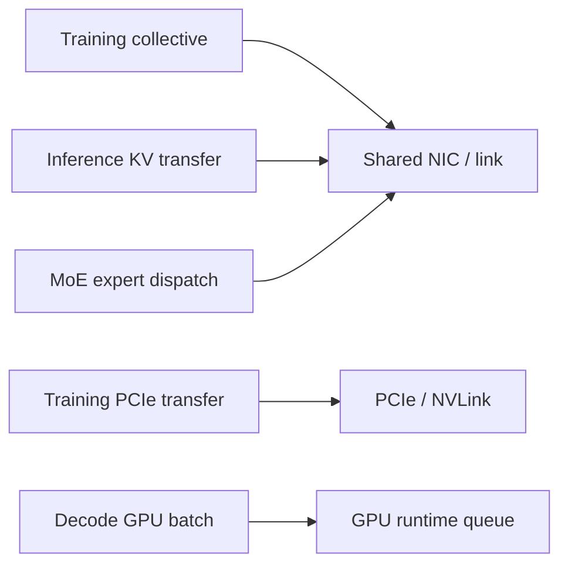
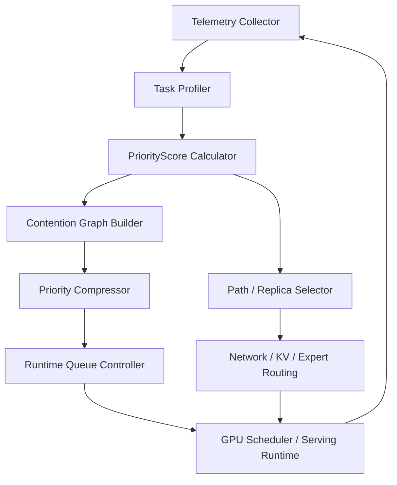

# 面向训练与推理的通信调度优化建模

本文档尝试把 Crux 论文中的思想扩展到更一般的 GPU 集群场景：既考虑分布式训练，也考虑在线推理。目标是建立一个统一的问题模型，说明当前系统的主要问题点，并给出可验证的优化方向。

## 1. 背景

GPU 集群中的训练和推理看起来 workload 不同，但底层都有一个共同矛盾：

> 昂贵 GPU 资源经常因为通信、远端内存访问、网络排队或调度等待而无法持续执行有效计算。

训练场景中，这表现为：

- AllReduce / ReduceScatter / AllGather 等 collective 被网络或 PCIe 拖慢；
- 多个训练作业共享链路时发生拥塞；
- 高 GPU 利用价值的作业被低价值通信流阻塞；
- 通信延迟无法完全被 compute/communication overlap 隐藏。

推理场景中，这表现为：

- 请求等待 prefill/decode 调度；
- KV cache transfer 或 remote memory read 阻塞 decode；
- MoE expert dispatch / all-to-all 出现热点；
- 高优先级或接近 SLO 的请求被低优先级请求拖慢；
- GPU batch slot 被等待通信的 sequence 占住，降低有效 token 吞吐。

因此，可以把问题抽象为：

> 当多个 GPU 任务共享计算、网络、PCIe、内存和 runtime 队列时，如何判断哪些任务被阻塞的代价最高，并优先为它们分配通信路径、队列优先级和执行机会。

## 2. 统一问题建模

### 2.1 调度对象

训练和推理的调度对象不同，但可以统一抽象为 `task`。

| 场景 | task 可以是什么 | 示例 |
|---|---|---|
| 分布式训练 | 训练 job、iteration、collective、rank group | 一个 AllReduce、一个 FSDP ReduceScatter |
| LLM 在线推理 | request、sequence group、prefill batch、decode batch | 一个用户请求、一组 decode sequences |
| PD 分离推理 | KV transfer task、decode task | prefill 节点向 decode 节点传 KV blocks |
| MoE 推理 | token group、expert dispatch group | 一层 MoE 中发往某 expert 的 token group |
| 多模型推理 | model replica queue、tenant queue | 某租户请求进入某模型副本 |

### 2.2 资源集合

每个 task 会占用或等待一组资源：

```text
R = {
  GPU compute,
  GPU memory / KV cache,
  PCIe / NVLink,
  NIC,
  ToR / aggregation / core network links,
  runtime queue,
  hardware priority queue
}
```

训练更偏向 collective communication 和网络链路；推理更偏向 runtime queue、KV cache、decode batch、remote memory 和 tail latency。

### 2.3 统一代价函数

Crux 的核心是 GPU intensity：

```text
I_j = W_j / t_j
```

可以扩展成更一般的阻塞代价：

```text
BlockingCost(task) =
  UsefulWorkAtRisk(task)
  / ExposedBlockingTime(task)
  * UrgencyFactor(task)
```

其中：

- `UsefulWorkAtRisk`：如果该 task 被阻塞，会影响多少后续 GPU 有效计算；
- `ExposedBlockingTime`：无法被 overlap、prefetch、batching 或异步执行隐藏的等待时间；
- `UrgencyFactor`：业务紧急度，比如 SLO slack、租户等级、请求优先级、训练 checkpoint deadline。

### 2.4 训练场景实例

训练中可以定义：

```text
TrainingCost(job) =
  GPU_compute_work_per_iteration
  / exposed_communication_time
  * job_priority
```

其中：

```text
exposed_communication_time =
  collective_time
  * (1 - compute_comm_overlap_ratio)
```

直觉：

- 一个 job 的 GPU 规模越大、每轮计算越重，通信阻塞造成的 GPU 浪费越大；
- 如果通信可以被计算隐藏，阻塞代价降低；
- 如果是关键业务训练或高优先级队列，可以提高 `job_priority`。

### 2.5 推理场景实例

推理中可以定义：

```text
InferenceCost(request) =
  remaining_gpu_work
  / exposed_wait_time
  * deadline_factor
```

其中：

```text
remaining_gpu_work =
  prefill_remaining_tokens * prefill_cost_per_token
  + decode_remaining_tokens * decode_cost_per_token
```

```text
exposed_wait_time =
  max(
    kv_transfer_wait
    + network_queueing
    + remote_memory_wait
    + runtime_queue_wait
    - overlap_budget,
    epsilon
  )
```

```text
deadline_factor =
  1 + alpha * max(0, 1 / slack_to_slo)
```

直觉：

- 请求越接近 SLO deadline，优先级越高；
- decode 阶段如果等 KV 或 expert dispatch，会直接影响 TPOT 和后续 batch；
- 长输出请求占用 batch slot 时间更久，阻塞代价不能只看当前一个 token。

## 3. 问题点

### 3.1 训练侧问题

#### 3.1.1 通信竞争被动发生

很多调度器只决定 job 放在哪些 GPU 上，但不显式控制 collective 流量走哪条路径。多个大规模训练作业可能同时挤到相同 ToR/PSW/DSW 链路。

问题结果：

- AllReduce tail 变长；
- iteration time 抖动；
- GPU 等通信完成；
- 集群有效 GPU 利用率下降。

#### 3.1.2 优先级没有反映 GPU 浪费

FIFO 或固定优先级无法区分：

- 一个 32-GPU 大模型训练被阻塞；
- 一个 4-GPU 小模型训练被阻塞。

两者对集群 GPU 时间的浪费完全不同。

#### 3.1.3 硬件优先级有限

真实网络和主机侧队列通常只有少数优先级，例如 4 或 8 个 traffic class。即使软件能算出很多逻辑优先级，也必须压缩。

问题是：简单按分数排序切分，可能把存在强竞争关系的任务压到同一硬件队列里。

#### 3.1.4 Intra-host 和 inter-host 竞争同时存在

训练通信既可能卡在跨机网络，也可能卡在节点内 PCIe/NVLink/NIC-GPU 路径。只做网络调度无法解决所有通信阻塞。

### 3.2 推理侧问题

#### 3.2.1 只看 GPU queue 不够

推理 router 常常根据 GPU queue length、KV cache 空间或 replica load 做路由，但忽略网络路径、KV transfer 和 remote memory 等等待。

结果：

- 选中了看似空闲但网络路径拥塞的 replica；
- decode GPU 等 KV；
- TTFT 或 TPOT tail 变差。

#### 3.2.2 请求优先级没有结合 SLO slack

同样一个请求，如果离 SLO deadline 还很远，可以等待；如果快要超时，就应该被优先调度。单纯 FIFO 或 shortest-job-first 都不能稳定降低 SLO violation。

#### 3.2.3 Continuous batching 会放大局部阻塞

LLM decode 是逐 token 推进的。一个 sequence 如果因为 KV、expert dispatch 或网络等待卡住，可能影响整个 batch 的推进节奏。

结果：

- batch 内部分 sequence 拖慢其他 sequence；
- GPU kernel launch 频率和 batch composition 变差；
- TPOT 和 throughput 变差。

#### 3.2.4 MoE 和 PD 分离引入更多通信热点

MoE 推理需要 token 到 expert 的 dispatch；PD 分离需要 KV cache 从 prefill 节点传给 decode 节点。这些通信不是可有可无的后台流量，而是请求 critical path。

如果没有优先级和路径控制，低紧急度请求的通信可能阻塞高紧急度请求。

## 4. 优化方向

### 4.1 统一调度分数

建立一个跨训练和推理的调度分数：

```text
PriorityScore(task) =
  UsefulWorkAtRisk(task)
  / ExposedBlockingTime(task)
  * UrgencyFactor(task)
```

训练侧：

- `UsefulWorkAtRisk` 取每轮 GPU compute work 或 GPU 数乘计算时间；
- `ExposedBlockingTime` 取 collective 通信中无法 overlap 的部分；
- `UrgencyFactor` 取 job priority、deadline、队列等级。

推理侧：

- `UsefulWorkAtRisk` 取剩余 prefill/decode GPU work；
- `ExposedBlockingTime` 取 KV transfer、network queueing、runtime queue wait 中无法隐藏的部分；
- `UrgencyFactor` 取 SLO slack、用户等级、请求类型。

### 4.2 感知代价的路径选择

训练：

```text
按 PriorityScore 从高到低遍历 job/collective
为每个 task 选择当前 weighted load 最低的 ECMP 路径
weighted_load += traffic(task) * PriorityScore(task)
```

推理：

```text
按 PriorityScore 从高到低遍历 request/sequence group
选择综合代价最低的 replica / KV source / expert path
weighted_load += transfer_size(task) * PriorityScore(task)
```

适用对象：

- 训练 collective path；
- KV cache transfer path；
- MoE expert dispatch path；
- replica routing；
- remote memory read path。

### 4.3 优先级分配

训练：

- 高 GPU intensity job 的 collective 流量获得更高网络优先级；
- 通信暴露比例高的 job 获得更高优先级；
- 大规模 job 不一定永远最高，需要结合 overlap 和 fairness。

推理：

- 接近 SLO deadline 的请求提高优先级；
- decode critical path 上的 KV transfer 提高优先级；
- 高价值租户或交互式请求优先于后台批处理请求；
- 长 decode 请求要防止长期占用最高优先级，需要 aging 或 fairness。

### 4.4 优先级压缩

逻辑优先级可能非常多，但硬件或 runtime 队列有限。

可以构造 contention graph：

```text
node = task
edge = 两个 task 共享关键资源
edge weight = 高优先级 task 的 PriorityScore 或受影响 GPU/token work
```

共享关键资源包括：

- 同一网络 link；
- 同一 NIC；
- 同一 PCIe switch；
- 同一 KV source；
- 同一 expert GPU；
- 同一 decode batch；
- 同一 model replica queue。

优化目标：

```text
把 task 压缩到 K 个优先级队列时，
尽量让高权重竞争边跨越不同优先级队列。
```

这样可以保留最重要的优先级关系，而不是简单按分数平均切段。

### 4.5 训练与推理的联合调度

在混部集群中，训练和推理可能共享 GPU/NIC/网络。

可以把训练 job 和推理 request 放到同一个资源竞争图里：



统一策略：

- 推理请求接近 SLO 时，可以短时压过训练通信；
- 训练高 GPU 浪费任务不能长期被推理小请求打断；
- 后台训练、离线 batch inference、在线 inference 分别设置不同 `UrgencyFactor`；
- 使用 aging 防止低优先级任务饥饿。

## 5. 系统架构草案



### 5.1 Telemetry Collector

采集：

- GPU utilization；
- kernel time；
- NCCL collective time；
- NIC queueing；
- PCIe/NVLink counters；
- KV transfer latency；
- request TTFT/TPOT；
- SLO slack；
- queue length；
- per-tenant priority。

### 5.2 Task Profiler

为 task 估算：

- 剩余 GPU work；
- 通信量；
- overlap 可能性；
- 共享资源集合；
- deadline / SLO slack。

### 5.3 PriorityScore Calculator

计算统一优先级分数：

```text
PriorityScore = UsefulWorkAtRisk / ExposedBlockingTime * UrgencyFactor
```

### 5.4 Contention Graph Builder

根据共享资源建立 task 之间的竞争关系。

### 5.5 Priority Compressor

把大量逻辑优先级压缩为：

- 网络 traffic class；
- runtime priority queue；
- GPU batch priority；
- KV transfer priority；
- expert dispatch priority。

### 5.6 Path / Replica Selector

负责选择：

- 训练 collective ECMP path；
- 推理 replica；
- KV source；
- expert placement/path；
- remote memory path。

## 6. 实验设计

### 6.1 训练实验

Baseline：

- random ECMP + same priority；
- intensity-only priority；
- network-aware path；
- Crux-style path + priority；
- Crux-style path + DAG compression。

指标：

- GPU utilization；
- iteration time；
- JCT；
- high-intensity job slowdown；
- network link utilization；
- fairness。

### 6.2 推理实验

Baseline：

- FIFO；
- shortest remaining tokens；
- earliest deadline first；
- GPU queue-aware routing；
- network-aware routing；
- unified PriorityScore routing。

指标：

- TTFT；
- TPOT；
- P95/P99 latency；
- SLO violation rate；
- tokens/s；
- GPU useful busy；
- KV transfer wait；
- per-tenant fairness。

### 6.3 混部实验

Workload：

- 多个分布式训练 job；
- 在线 LLM serving；
- batch inference；
- MoE 或 PD 分离推理流量。

指标：

- 在线推理 SLO violation；
- 训练 iteration slowdown；
- 总 GPU useful utilization；
- 网络拥塞时长；
- 低优先级 starvation。

## 7. 落地路线

### 阶段 1：离线模拟器

目标：验证统一建模是否有收益。

工作：

- 扩展当前 `crux_sim.py`；
- 加入 inference request trace 生成器；
- 支持训练 + 推理混部 task；
- 实现统一 `PriorityScore`；
- 实现 contention graph priority compression；
- 输出训练和推理双侧指标。

### 阶段 2：推理 runtime 原型

目标：在 vLLM/Triton/TGI 一类 runtime 上验证调度效果。

工作：

- 在 request scheduler 中加入 priority score；
- 在 continuous batching 中加入 priority-aware sequence selection；
- 对 KV transfer 加优先级队列；
- 对 replica router 加 network/KV-aware cost。

### 阶段 3：网络与硬件队列联动

目标：把逻辑优先级映射到真实队列。

工作：

- DSCP / traffic class 标记；
- RoCE priority queue；
- source-port steering；
- NIC queue 监控；
- PCIe/NVLink 本地竞争控制。

### 阶段 4：生产化保护

目标：避免优先级系统造成饥饿或不可解释。

工作：

- aging；
- per-tenant quota；
- priority cap；
- fallback policy；
- 可观测性 dashboard；
- A/B test 和灰度。

## 8. 风险与注意事项

1. 统一分数不能只追求高 GPU 利用率，否则可能伤害推理 tail latency；
2. 推理请求有强 SLO 约束，训练 job 有长周期吞吐目标，两者需要不同 `UrgencyFactor`；
3. 优先级过多必须压缩，否则无法映射到真实硬件；
4. 过度偏向高优先级请求可能造成低优先级训练或 batch inference 饥饿；
5. 观测数据不完整时，`ExposedBlockingTime` 估算可能不稳定；
6. 真实系统里路径选择、队列优先级、runtime batch 调度之间存在反馈，需要闭环控制。

## 9. 初步结论

Crux 思想可以从训练通信调度扩展到训练 + 推理统一优化。关键不是照搬训练中的 `GPU intensity`，而是抽象出更一般的阻塞代价：

```text
被阻塞时会浪费多少有效 GPU 工作，
这些等待有多少无法被隐藏，
以及这个任务有多紧急。
```

基于这个分数，可以统一指导：

- 训练 collective 的路径选择和网络优先级；
- 推理 request / sequence 的 runtime 调度；
- KV cache transfer 优先级；
- MoE expert dispatch 路径；
- 多模型 replica routing；
- 训练与推理混部时的资源仲裁。

这条路线适合先在离线模拟器中验证趋势，再逐步迁移到真实推理 runtime 和网络队列。
