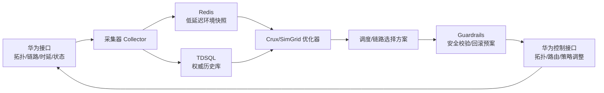
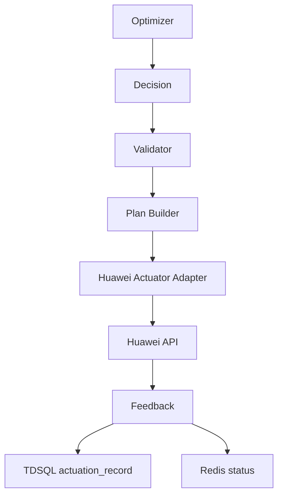

# 实机环境拓扑与网络时延接入方案

本文档用于把当前 SimGrid/Crux 模拟推进到实机闭环：从华为侧接口获取真实网络拓扑和链路时延，把环境信息落到本地 TDSQL/Redis，优化器从本地数据读取环境视图，计算调度/链路选择方案，再通过华为接口调整物理网络拓扑或路由策略。

## 1. 目标

当前 SimGrid 模型已经能表达多机多卡 collective 通信竞争，但拓扑、链路带宽、链路时延仍是简化参数。下一步要解决两个问题：

1. 优化器看到的拓扑必须接近真实环境；
2. 优化器输出的链路选择或拓扑调整方案必须能落到华为侧控制接口。

因此需要构建一条数据闭环：



## 2. 数据来源：iMaster NCE-Fabric 北向 API

> **文档来源**: iMaster NCE-Fabric V100R024C10 API 开发指南（CHM 解包为 HTML，`imaster_nce_fabric_api_extracted/`）
> **SLA**: 性能类接口为"最终一致，不一致时长 < 30 秒"；拓扑类接口为准实时。

### 2.1 接口总览：按 Crux 数据需求分类

| Crux 需求 | iMaster API 端点 | 方法 | 返回关键字段 |
|---|---|---|---|
| **设备列表** | `/rest/openapi/network/nedevice` | GET | deviceId, deviceName, deviceType, deviceModel, ip, status, siteId |
| **设备拓扑** | `/acdcn/v3/topoapi/dcntopo/device` | GET | 设备列表（含上联/下联关系）、设备角色、机架位置 |
| **物理链路** | `/rest/openapi/network/link` | GET | linkId, srcNode, dstNode, srcPort, dstPort, bandwidth, linkType, status |
| **设备间链路** | `/rest/controller/dc/v3/north/dynamicmap/query-devicelink` | POST | 端到端设备链路、路径经过的中间节点 |
| **链路拓扑** | `/acdcn/v3/topoapi/dcntopo/getLinks` | POST | 链路列表（含层级、绑定关系） |
| **端口信息** | `/rest/openapi/network/port` | GET | portId, portName, portSpeed, portStatus, deviceId |
| **接口详情** | `/rest/openapi/networkinventoryservice/v2/interfaces` | GET | ifName, ifIndex, mtu, speed, adminStatus, operStatus, ipAddress |
| **端口拓扑** | `/acdcn/v3/topoapi/dcntopo/getPorts` | POST | 端口级拓扑，含端口-设备绑定 |
| **实时性能** | `/rest/openapi/dps-service/v1/realtime-task` | PUT | 创建实时性能采集任务（利用率/丢包/时延） |
| **历史性能** | `/rest/openapi/dps-service/v1/history-data` | POST | 查询历史性能数据（利用率/丢包/时延/ECN/PFC） |
| **RoCE 配置** | RoCE 网络配置相关接口 | GET/POST | PFC 优先级、ECN 标记、QoS 队列、流量策略 |
| **NPU 卡信息** | 查询 NPU 卡地址信息 | GET | NPU ID、MAC、IP、所属服务器、PCIe 地址 |
| **AI 任务** | 北向查询 AI 任务 | GET | jobId, jobName, NPU 占用、开始/结束时间 |
| **接口 QoS** | 查询接口 MTU/PFC/ECN/CRC/QoS | GET | 每个接口的 QoS 参数、计数器 |
| **主机链路** | 查询主机链路 / 查询终端端口 | GET | 服务器到交换机的物理连接 |
| **主机列表** | VM/BM 列表 / Host 列表 | GET | hostId, hostName, hostType(BM/VM), NPU 列表, NIC 列表 |

### 2.2 详细映射表：Crux 建模字段 → iMaster API

> 标记说明：**P** = 分页参数, **D** = 依赖上游接口, **R** = 建议刷新周期

#### 2.2.1 设备与拓扑层

| Crux 字段 | iMaster 端点 | 关键请求参数 | 响应路径 | 备注 |
|---|---|---|---|---|
| `host_id`, `host_name` | `GET /rest/openapi/network/nedevice` | `?pageIndex&pageSize&deviceType=server` | `$.data[].deviceId/deviceName` | 也可从 Host 列表接口获取 |
| `switch_id`, `switch_name`, `switch_role` | `GET /rest/openapi/network/nedevice` | `?deviceType=switch` | `$.data[]` | deviceRole 区分 ToR/Leaf/Spine/Core |
| `switch_model` | 同上 | — | `$.data[].deviceModel` | 用于查端口数量和类型 |
| `device_status` | 同上 | — | `$.data[].status` | up/down/degraded |
| `site_id`, `rack_id` | `GET /acdcn/v3/topoapi/dcntopo/device` | `?siteId` | `$.data[]` | 物理位置，用于 placement 约束 |
| `device_neighbors` | `POST /acdcn/v3/topoapi/dcntopo/getLinks` | `{"deviceIds":[...]}` | `$.data[]` | 设备间的物理连接关系 |

**分页**: 设备类接口通常 `pageIndex` + `pageSize`，单页上限 100-500。
**依赖**: 设备列表 → deviceId → 链路/端口查询。
**刷新**: **R=5min**（设备上下线事件驱动 + 定时全量对账）。

#### 2.2.2 链路与带宽层

| Crux 字段 | iMaster 端点 | 关键请求参数 | 响应路径 | 备注 |
|---|---|---|---|---|
| `link_id`, `link_name` | `GET /rest/openapi/network/link` | `?deviceId&pageIndex` | `$.data[].linkId` | 物理链路标识 |
| `src_device`, `dst_device` | 同上 | — | `$.data[].srcNode/dstNode` | 两端设备 ID |
| `src_port`, `dst_port` | 同上 | — | `$.data[].srcPort/dstPort` | 两端端口 |
| `bandwidth_bps` | 同上 | — | `$.data[].bandwidth` | 标称带宽，需单位转换 |
| `link_type` | 同上 | — | `$.data[].linkType` | HCCS/PCIe/Ethernet/RoCE |
| `link_status` | 同上 | — | `$.data[].status` | up/down/degraded |
| `device_link_path` | `POST /rest/controller/dc/v3/north/dynamicmap/query-devicelink` | `{"srcDeviceId","dstDeviceId"}` | 路径数组 | 两点间完整路径（经过哪些中间设备） |

**分页**: 链路接口 `pageIndex` + `pageSize`。
**依赖**: 先查设备列表获得 deviceId，再按设备查链路。建议按 site/ToR 分批。
**刷新**: **R=1min**（拓扑变更事件驱动 + 定时全量）。

#### 2.2.3 端口与接口层

| Crux 字段 | iMaster 端点 | 关键请求参数 | 响应路径 | 备注 |
|---|---|---|---|---|
| `port_id`, `port_name` | `GET /rest/openapi/network/port` | `?deviceId&pageIndex` | `$.data[].portId/portName` | 物理端口 |
| `port_speed` | 同上 | — | `$.data[].portSpeed` | 协商速率 / 配置速率 |
| `port_status` | 同上 | — | `$.data[].portStatus` | up/down/adminDown |
| `port_device_binding` | `POST /acdcn/v3/topoapi/dcntopo/getPorts` | `{"deviceIds":[...]}` | `$.data[]` | 端口-设备-链路三方绑定 |
| `if_mtu` | `GET /rest/openapi/networkinventoryservice/v2/interfaces` | `?deviceId` | `$.data[].mtu` | 接口 MTU |
| `if_speed`, `if_status` | 同上 | — | `$.data[].speed/adminStatus/operStatus` | 逻辑接口信息 |
| `if_ip` | 同上 | — | `$.data[].ipAddress` | 接口 IP 地址 |
| `if_qos_pfc` | 接口下 QoS 查询 | `?interfaceName` | PFC 配置和计数器 | PFC 优先级使能、PFC 帧计数 |
| `if_qos_ecn` | 同上 | `?interfaceName` | ECN 配置和计数器 | ECN 标记计数 |
| `if_qos_crc` | 同上 | `?interfaceName` | CRC 错误计数 | 物理层质量 |
| `if_queue_config` | 同上 | `?interfaceName` | 队列调度策略 | SP/WRR/DRR |

**分页**: 按 deviceId 分页。
**依赖**: deviceId → port list → interface detail。
**刷新**: 端口状态 **R=30s**；QoS 计数器 **R=10s**（性能类接口）。

#### 2.2.4 性能与时延层

| Crux 字段 | iMaster 端点 | 关键请求参数 | 响应路径 | 备注 |
|---|---|---|---|---|
| `link_utilization` | `POST /rest/openapi/dps-service/v1/history-data` | `{"metricType":"link_util","deviceIds":[],"timeRange":{}}` | 时间序列 | 先创建实时任务再查历史 |
| `link_latency_us` | 同上 | `metricType: "link_latency"` 或 `"link_delay"` | 时间序列 | 需确认时延是探测值还是统计值 |
| `link_loss_rate` | 同上 | `metricType: "link_loss"` | 时间序列 | 丢包率 |
| `link_error_rate` | 同上 | `metricType: "link_error"` 或结合 CRC 计数 | 时间序列 | 物理层错误 |
| `port_queue_depth` | 同上 | `metricType: "queue_depth"` 或 `"buffer_usage"` | 时间序列 | 队列深度，反映拥塞程度 |
| `ecn_marked_pkts` | 同上 | `metricType: "ecn_marked"` | 时间序列 | ECN 标记包数 |
| `pfc_pause_frames` | 同上 | `metricType: "pfc_pause"` | 时间序列 | PFC 暂停帧数，反映优先级流控触发频率 |
| `realtime_task_id` | `PUT /rest/openapi/dps-service/v1/realtime-task` | `{"metricType","deviceIds","interval":10}` | taskId | 创建实时采集任务 |

**SLA**: 最终一致，不一致时长 < 30 秒。
**分页**: 历史数据通常按时间窗口分段拉取。
**依赖**: deviceId/portId → 创建 realtime-task → 轮询 taskId → 查历史数据。
**刷新**: 实时任务 10-30s 间隔；历史数据按需查询。

#### 2.2.5 算卡与 AI 任务层

| Crux 字段 | iMaster 端点 | 关键请求参数 | 响应路径 | 备注 |
|---|---|---|---|---|
| `npu_id`, `npu_mac`, `npu_ip` | 查询 NPU 卡地址信息 | `?hostId` 或 `?deviceId` | NPU 列表 | 每张 NPU 的标识和网络地址 |
| `npu_pcie_addr` | 同上 | — | PCIe BDF 地址 | 用于构建 host 内部拓扑 |
| `npu_nic_binding` | 查询主机链路 + NPU 卡信息 | hostId → NPU → NIC | 间接推断 | 可能需要交叉关联 |
| `job_id`, `job_name` | 北向查询 AI 任务 | `?status=running` | 任务列表 | 当前运行的训练作业 |
| `job_npu_usage` | 同上 | — | job 占用的 NPU 列表 | 核心：job → NPU 映射 |
| `job_start_time`, `job_end_time` | 同上 | — | 时间戳 | 用于 trace replay |
| `host_npu_list` | VM/BM 列表 / Host 列表 | `?hostType=BM` | host 下 NPU 列表 | 裸金属服务器的 NPU 清单 |

**依赖**: hostId → NPU 列表 → job 占用关系。
**刷新**: 算卡拓扑 **R=5min**；AI 任务 **R=30s**（任务状态变化频繁）。

#### 2.2.6 RoCE 与 QoS 配置层

| Crux 字段 | iMaster 端点 | 关键请求参数 | 响应路径 | 备注 |
|---|---|---|---|---|
| `pfc_priority_enable` | RoCE 网络配置 / 接口 QoS | `?interfaceName` | PFC 位图 | 哪些优先级开启了 PFC |
| `ecn_config` | 同上 | — | ECN 阈值 | ECN 标记阈值 (Kmin/Kmax/Pmax) |
| `qos_queue_schedule` | 同上 | — | 队列调度策略 | SP/WRR/DRR + 权重 |
| `traffic_class_map` | 同上 | — | DSCP/PCP → TC 映射 | 优先级到硬件队列的映射 |
| `dcqcn_config` | RoCE 网络配置 | — | DCQCN 参数 | 拥塞控制算法参数 |
| `roce_global_config` | RoCE 网络配置 | — | 全局 RoCE 开关/参数 | RoCE 使能状态、版本 |

**依赖**: deviceId → interface → QoS 详情。
**刷新**: **R=10min**（QoS 配置变更不频繁，配置变更事件驱动即可）。

### 2.3 采集依赖拓扑图

```
                         ┌─────────────────────┐
                         │  Site / Cluster ID   │
                         └────────┬────────────┘
                                  │
                    ┌─────────────┼─────────────┐
                    ▼             ▼             ▼
           ┌───────────┐  ┌───────────┐  ┌───────────┐
           │ nedevice  │  │ VM/BM列表 │  │  AI 任务  │
           │ (设备列表) │  │ (Host列表)│  │ (Job列表) │
           └─────┬─────┘  └─────┬─────┘  └─────┬─────┘
                 │              │              │
         ┌───────┼───────┐      │              │
         ▼       ▼       ▼      ▼              ▼
   ┌────────┐┌──────┐┌────────┐ ┌──────────┐ ┌──────────┐
   │ link   ││ port ││ dcntopo│ │NPU卡信息 │ │job→NPU   │
   │(链路)  ││(端口)││(拓扑)  │ │(算卡绑定)│ │ 映射     │
   └───┬────┘└──┬───┘└───┬────┘ └────┬─────┘ └────┬─────┘
       │        │        │           │            │
       └────────┼────────┘           │            │
                ▼                    ▼            ▼
         ┌────────────┐      ┌────────────────────────┐
         │devicelink  │      │  host → NPU → NIC      │
         │(端到端路径)│      │  (host 内部拓扑)        │
         └─────┬──────┘      └───────────┬────────────┘
               │                         │
               └──────────┬──────────────┘
                          ▼
                ┌──────────────────┐
                │ 性能数据采集      │
                │ realtime-task →  │
                │ history-data     │
                │ (时延/利用率/QoS) │
                └────────┬─────────┘
                         ▼
                ┌──────────────────┐
                │ QoS 配置快照      │
                │ PFC/ECN/Queue    │
                │ (RoCE 参数)       │
                └────────┬─────────┘
                         ▼
                ┌──────────────────┐
                │  本地环境快照     │
                │  TDSQL + Redis   │
                └──────────────────┘
```

### 2.4 采集刷新策略

| 数据层级 | 刷新周期 | 触发方式 | 原因 |
|---|---|---|---|
| 设备/拓扑 (nedevice, dcntopo) | **5 min** | 定时全量 + 事件增量 | 拓扑变化频率低，但需要及时发现变更 |
| 链路/端口状态 (link, port) | **1 min** | 定时全量 | 链路 up/down 影响路径计算 |
| 实时性能 (util/latency/loss) | **10-30 s** | 实时任务推送 | 性能数据窗口短，用于在线决策 |
| AI 任务状态 (job → NPU) | **30 s** | 定时轮询 | 任务动态到达/退出 |
| QoS 配置 (PFC/ECN/Queue) | **10 min** | 事件驱动 + 定时对账 | 配置变更频率低 |
| NPU 卡信息 | **5 min** | 定时全量 | 硬件信息稳定 |

### 2.5 采集器 Collector 设计要点

```
Collector
├── DeviceCollector     → 设备列表 (nedevice + dcntopo/device)
├── LinkCollector        → 链路列表 (link + getLinks + query-devicelink)
├── PortCollector        → 端口列表 (port + getPorts + interfaces)
├── MetricCollector      → 性能数据 (realtime-task → history-data)
├── NPUCollector         → NPU 卡信息 + host 内部拓扑
├── JobCollector         → AI 任务 + job→NPU 映射
├── QoSCollector         → RoCE/PFC/ECN/QoS 配置快照
└── SnapshotBuilder      → 组装环境快照 → TDSQL + Redis
```

**批处理与限流**：
- 设备/链路/端口：按 site/ToR 分组并发，每组串行翻页
- 性能任务：按 deviceId 分片，避免单次查询过大
- 全量采集间隔内留出 50% 空闲时间给华为接口
- 响应超时 > 30s 时写告警日志，不中断其他采集器
- 接口调用频率需与华为侧确认 QPS 上限

**幂等与去重**：
- deviceId/linkId/portId 作为主键 upsert
- snapshot_id = timestamp + collector_version
- 同一 snapshot 内重复条目以最后到达为准

**数据质量评分**：
- 每个采集器的覆盖率 = 实际获取条目数 / 预期条目数
- 缺失字段比例
- 最近一次成功采集时间
- 质量评分 < 阈值时优化器降级到上一版快照或静态配置

## 3. 本地存储设计

### 3.1 TDSQL：权威历史库

TDSQL 负责保存可追溯、可审计的环境数据和优化决策。它适合做历史分析、回放、离线校准和问题追责。

建议表：

| 表 | 说明 |
|---|---|
| `hw_node` | 服务器、交换机、NPU/GPU/NIC 等节点 |
| `hw_port` | 端口、端口速率、端口状态 |
| `hw_link` | 物理链路，包含 src/dst node/port、带宽、链路类型 |
| `hw_route_candidate` | 候选路径，记录经过的 link 序列 |
| `net_metric_snapshot` | 周期性链路指标快照，如时延、利用率、丢包、ECN/PFC |
| `optimizer_input_snapshot` | 优化器使用的环境快照版本 |
| `optimizer_decision` | 优化器输出的 placement/path/priority 方案 |
| `actuation_record` | 下发华为接口的操作、结果、失败原因、回滚状态 |

核心字段建议：

```text
snapshot_id
cluster_id
node_id
node_type
device_model
port_id
link_id
src_node_id
dst_node_id
bandwidth_bps
latency_us
utilization
loss_rate
ecn_count
pfc_count
status
observed_at
source_api
confidence
```

### 3.2 Redis：优化器在线快照

Redis 负责给优化器提供低延迟读取。优化器不应该每次直接打华为接口，也不应该在线扫 TDSQL 大表。

建议 key 设计：

| Key | Value | TTL |
|---|---|---|
| `topo:{cluster_id}:current` | 当前拓扑版本号和摘要 | 长 TTL |
| `topo:{cluster_id}:nodes` | node 列表 JSON/MsgPack | 长 TTL |
| `topo:{cluster_id}:links` | link 列表 JSON/MsgPack | 长 TTL |
| `topo:{cluster_id}:routes` | 候选路径集合 | 长 TTL |
| `metric:{cluster_id}:links` | 最新链路时延/利用率/状态 | 短 TTL |
| `snapshot:{snapshot_id}` | 优化器输入快照 | 长 TTL |
| `decision:{decision_id}` | 优化器输出方案 | 长 TTL |

Redis 中建议保存两类视图：

1. 当前视图：优化器在线使用；
2. 固化快照：某次优化决策使用的完整输入，便于复盘。

## 4. 优化器读取方式

优化器运行时只读本地环境信息：

```text
Redis current snapshot
  -> 缺失或过期时读取 TDSQL 最近稳定快照
  -> 仍不可用时降级到静态配置
```

优化器输入应包含：

- 当前可用 host/card；
- host 到 NPU/GPU/NIC 的绑定关系；
- host-to-host 候选路径；
- 每条 link 的带宽、时延、利用率、状态；
- 每条 path 的聚合代价；
- 当前 job/workload 的 placement 约束；
- 可执行的控制动作列表。

路径代价建议：

```text
path_cost =
  alpha * sum(link_latency_us)
  + beta * max(link_utilization)
  + gamma * sum(queue_or_pfc_penalty)
  + delta * failure_or_degraded_penalty
```

对于训练 collective，可以再乘以 job 的通信敏感度：

```text
weighted_path_cost =
  path_cost * communication_sensitivity * gpu_intensity
```

## 5. 华为控制接口执行方式

用户提到“网络链路选择通过华为接口调整物理网络拓扑，具体接口待定”。在接口未确定前，建议把执行层抽象成 `Actuator`，不要让优化器直接耦合某个具体接口。



建议控制动作模型：

| 动作 | 说明 | 风险 |
|---|---|---|
| `set_path_preference` | 调整某些 job/flow 的候选路径偏好 | 中 |
| `update_route_policy` | 修改路由策略或策略路由 | 高 |
| `update_ecmp_weight` | 调整 ECMP 权重或 hash 相关参数 | 中/高 |
| `update_traffic_class` | 调整队列/TC/优先级映射 | 中 |
| `disable_degraded_link` | 避开降级链路 | 高 |
| `rollback_decision` | 回滚上一次调整 | 必须支持 |

上线前必须加保护：

- dry-run 模式；
- 只读模拟模式；
- 小流量/白名单 job 试点；
- 变更前后拓扑一致性检查；
- 超时自动回滚；
- 决策幂等 id；
- 每次下发写入 `actuation_record`；
- 操作权限隔离，避免优化器直接拥有高危接口权限。

## 6. 与 SimGrid 的关系

真实拓扑数据有两种用途：

1. 生成 SimGrid platform：
   - `hw_node` -> host/switch/netzone；
   - `hw_link` -> link；
   - `hw_route_candidate` -> route；
   - `net_metric_snapshot` -> bandwidth/latency/factor。

2. 作为在线优化器输入：
   - 当前链路状态；
   - 候选路径代价；
   - 拥塞和故障标记；
   - 可调整路径集合。

建议新增一个拓扑导出层：

```text
TDSQL/Redis topology snapshot
  -> topology_normalizer
  -> cluster_config.yaml
  -> SimGrid platform builder
```

这样 SimGrid 和在线优化器共享同一个“环境事实源”，避免模拟配置和线上配置分叉。

## 7. 推荐落地阶段

### 阶段 1：只读采集

目标：先打通华为接口到本地环境快照，不做任何控制。

产出：

- Collector；
- TDSQL 表；
- Redis current snapshot；
- 拓扑快照导出；
- 数据质量报告。

验收：

- 能稳定获取服务器/NPU/NIC/交换机/链路关系；
- 能获取链路时延和状态；
- 能按 snapshot_id 复现某一时刻拓扑。

### 阶段 2：SimGrid 校准

目标：用真实拓扑生成 SimGrid platform，替换当前简化拓扑。

产出：

- `cluster_config.yaml`；
- platform builder；
- SimGrid platform diff 工具；
- 与 HCCL benchmark 的误差报告。

验收：

- 单 job collective 模拟结果能和 HCCL benchmark 对齐到可解释范围；
- 能定位某次通信慢是由哪条链路或哪类路径导致。

### 阶段 3：只读优化建议

目标：优化器只输出建议，不下发华为接口。

产出：

- placement/path/priority 建议；
- 预计收益；
- 风险标记；
- 对比当前策略的 SimGrid replay。

验收：

- 能对历史窗口 replay，验证建议收益；
- 能解释建议为什么选择某条路径或某组 host。

### 阶段 4：小范围闭环控制

目标：通过华为接口对小范围白名单 job 或测试集群下发调整。

产出：

- actuator adapter；
- dry-run / apply / rollback；
- actuation audit；
- 线上前后对比报告。

验收：

- 控制动作可回滚；
- 不影响非白名单业务；
- 实测收益方向与 SimGrid 预测一致。

## 8. 接口确认状态

> **来源**: iMaster NCE-Fabric V100R024C10 API 开发指南（`imaster_nce_fabric_api_extracted/`）

### 8.1 已确认可用的接口

| 能力 | iMaster 端点 | 状态 | 备注 |
|---|---|---|---|
| 设备信息 | `GET /rest/openapi/network/nedevice` | ✅ 已确认 | 支持 deviceType=server/switch 过滤 |
| 设备拓扑 | `GET /acdcn/v3/topoapi/dcntopo/device` | ✅ 已确认 | 含层级和机架信息 |
| 物理链路 | `GET /rest/openapi/network/link` | ✅ 已确认 | 含 src/dst device/port/bandwidth |
| 设备间路径 | `POST /rest/controller/dc/v3/north/dynamicmap/query-devicelink` | ✅ 已确认 | 端到端完整路径 |
| 链路拓扑 | `POST /acdcn/v3/topoapi/dcntopo/getLinks` | ✅ 已确认 | 批量查询链路 |
| 端口信息 | `GET /rest/openapi/network/port` | ✅ 已确认 | 含 speed/status |
| 接口详情 | `GET /rest/openapi/networkinventoryservice/v2/interfaces` | ✅ 已确认 | 含 mtu/speed/status/ip |
| 端口拓扑 | `POST /acdcn/v3/topoapi/dcntopo/getPorts` | ✅ 已确认 | 端口-设备绑定 |
| 实时性能任务 | `PUT /rest/openapi/dps-service/v1/realtime-task` | ✅ 已确认 | SLA: 不一致 < 30s |
| 历史性能数据 | `POST /rest/openapi/dps-service/v1/history-data` | ✅ 已确认 | util/latency/loss/ecn/pfc |
| RoCE 配置 | RoCE 网络配置相关接口 | ✅ 已确认 | PFC/ECN/Queue/DCQCN |
| NPU 卡信息 | 查询 NPU 卡地址信息 | ✅ 已确认 | NPU ID/MAC/IP/PCIe |
| AI 任务查询 | 北向查询 AI 任务 | ✅ 已确认 | job→NPU 映射 |
| 接口 QoS | 查询接口 MTU/PFC/ECN/CRC/QoS | ✅ 已确认 | 每接口 QoS 计数器和配置 |
| 主机链路 | 查询主机链路 / 查询终端端口 | ✅ 已确认 | 服务器-交换机连接 |
| Host 列表 | VM/BM 列表 / Host 列表 | ✅ 已确认 | host 和 NPU/NIC 绑定 |

### 8.2 尚需确认的问题

| 问题 | 优先级 | 影响 |
|---|---|---|
| NPU → NIC 绑定关系是否能直接查询，还是需要交叉关联？ | **高** | 影响 host 内部拓扑建模 |
| 链路时延是主动探测值 (TWAMP) 还是设备统计值？ | **高** | 影响路径代价公式 |
| 各接口的 QPS 上限和单次翻页最大条目数？ | **高** | 影响采集器并发设计 |
| 是否支持按 site/cluster 过滤设备/链路查询？ | **中** | 影响采集效率 |
| AI 任务接口返回的 NPU 占用是实时还是最终一致？ | **中** | 影响 job placement 时效 |
| 是否有接口可以查询交换机路由表/FIB/ECMP 配置？ | **中** | 影响 path selection 精度 |
| 拓扑变更事件是否有 webhook/订阅机制？ | **低** | 目前可用定时全量对账替代 |
| 是否有批量查询接口（单次多 deviceId），避免 N+1 问题？ | **低** | dcntopo 系列接口已支持批量 |

## 9. 关键风险

| 风险 | 说明 | 缓解 |
|---|---|---|
| 拓扑数据不完整 | 缺少端口/NIC/链路绑定会导致路径计算错误 | 数据质量评分，缺失时降级 |
| 时延数据波动 | 瞬时探测值可能误导优化器 | 多窗口平滑，置信度字段 |
| 控制接口风险高 | 路由/拓扑调整可能影响非目标业务 | 白名单、dry-run、回滚、限流 |
| 模拟和线上不一致 | SimGrid 预测不等于真实 HCCL 行为 | HCCL benchmark 校准 |
| 存储视图过期 | Redis 快照过期会导致错误决策 | TTL、snapshot version、fallback |

## 10. 与后续优化路线的关系

这部分对应 `SIMGRID_COLLECTIVE_SIMULATION_PLAN.zh-CN.md` 中的：

- 11.1 拓扑从“可跑”升级到“可校准”；
- 11.2 HCCL benchmark 校准；
- 11.3 path selection / priority / compression；
- 11.5 背景流和扰动场景；
- 11.6 可解释指标和链路利用率可视化。

优先级建议：先做只读采集和本地快照，再做 SimGrid platform 生成；控制接口闭环放到最后，必须等 dry-run、审计、回滚机制完整后再接入。
