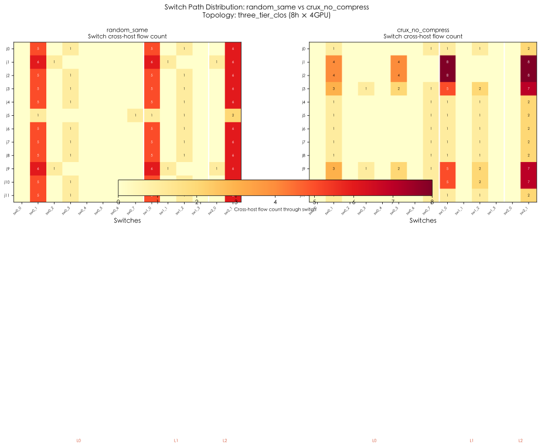
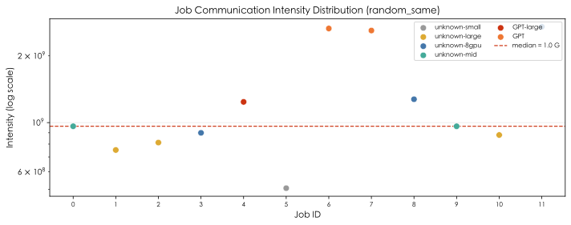
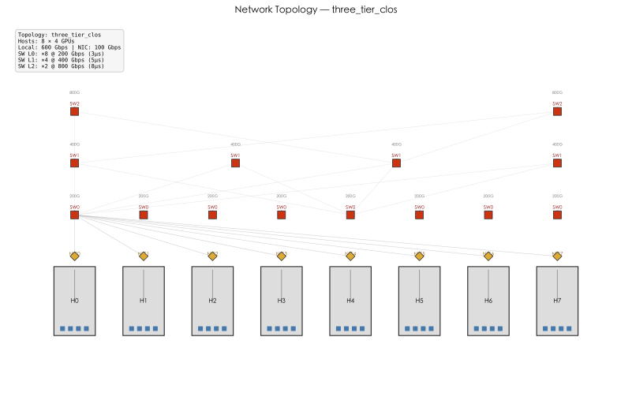

# Crux 通信感知调度：方法复现与模拟验证报告

> **目标读者**：上级领导、同事（技术评审）
> **状态**：机制验证阶段，非生产结论
> **日期**：2026-05-15

---

## 目录

1. [摘要](#1-摘要)
2. [Crux 论文方法概述](#2-crux-论文方法概述)
3. [复现方法](#3-复现方法)
4. [核心结果](#4-核心结果)
5. [可视化分析](#5-可视化分析)
6. [关键发现与讨论](#6-关键发现与讨论)
7. [局限性与下一步](#7-局限性与下一步)

---

## 1. 摘要

本项目基于 Crux 论文（SIGCOMM '24 前后）的通信强度感知调度思想，使用 **SimGrid S4U/C++** 真实模拟器和 **Python 轻量离散事件模拟**两个层次，对多机多卡训练集群中 collective 通信竞争场景进行了机制复现。

**核心结论**：在 12-job Lingjun 生产 trace 窗口上，Crux 风格的通信强度感知放置策略（`crux_no_compress`）相对随机基线：

| 指标 | 基线 (random_same) | Crux (crux_no_compress) | 改善 |
|---:|---:|---:|---:|
| **Makespan** | 95.3 s | 83.2 s | **−12.73%** |
| **平均 JCT** | 53.0 s | 45.0 s | **−15.07%** |
| **平均通信时间** | 31.6 s | 22.1 s | **−30.07%** |
| **Useful GPU Fraction** | 0.469 | 0.537 | **+14.6%** |

- 12 个 job 中 **10 个 JCT 改善**，Top gain 为 GPT-large job（JCT −24.7%，通信时间 −47.5%）
- 轻量模拟补充验证显示，在极端拥塞场景下 GPU util 提升可达 **22-32%**
- 优先级压缩级别 K=4 在当前规模下达到饱和

> **注意**：当前结果基于模拟环境，未使用实机昇腾 920 + 910B 拓扑和 HCCL benchmark 参数校准。结论为机制验证性质，不直接等同于生产收益预估。

---

## 2. Crux 论文方法概述

### 2.1 问题背景

在大规模 GPU 集群中，多个训练作业并发运行时，**collective 通信（如 AllReduce）会在共享网络链路上产生竞争**。传统调度器（如 Kubernetes default scheduler、Volcano）主要考虑 GPU 卡数、内存等计算资源，不感知通信强度和网络拓扑，导致：

- 高通信强度的训练作业被随机放置，跨机通信经过大量交换机和链路
- 多个高通信作业共享瓶颈链路，通信等待时间急剧增加
- GPU 空转比例高，集群有效利用率低

### 2.2 Crux 核心思想

Crux 提出三层机制来解决这个问题：

```
┌─────────────────────────────────────────────────┐
│                  Crux Scheduler                   │
├─────────────────────────────────────────────────┤
│  1. Intensity-aware Path Selection               │
│     └─ 按通信强度排序 job，为高通信 job 选择      │
│        负载最低的网络路径（交换机/链路）            │
│                                                   │
│  2. Priority Assignment                           │
│     └─ 综合考虑 GPU 通信强度、通信敏感度、         │
│        阻塞代价，给每个 job 分配逻辑优先级         │
│                                                   │
│  3. Priority Compression (DAG K-cut)              │
│     └─ 将无限逻辑优先级压缩到 K 个硬件队列        │
│        （如 RoCE 的 8 个 traffic class）           │
└─────────────────────────────────────────────────┘
```

**关键直觉**：
- 把大象（高通信 job）放到不同的房间（交换机路径），避免挤在一起踩坏地板（链路拥塞）
- 给大象更高的优先级（priority），确保它的通信不被老鼠（低通信 job）阻塞
- 硬件优先级队列数量有限（K=4~8），需要将逻辑优先级「压缩」到硬件队列中

### 2.3 论文关键指标

| 指标 | 含义 |
|---|---|
| **Makespan** | 所有 job 完成的总时间（从第一个开始到最后一个结束） |
| **JCT** (Job Completion Time) | 单个 job 从开始到完成的时间 |
| **Communication Time** | job 在 collective 通信上的等待时间 |
| **Useful GPU Fraction** | GPU 真正做计算的时间占比 = Σ(compute × ranks) / (makespan × total GPUs) |
| **Intensity** | 通信强度 ≈ tensor_bytes / compute_time，越高表示通信越密集 |

---

## 3. 复现方法

### 3.1 两层模拟体系

我们采用 **两层互补模拟**，而非直接复现论文的 96-GPU 实机测试床：

| 层次 | 技术栈 | 用途 |
|---|---|---|
| **真实 SimGrid 模拟** | SimGrid 4.1 S4U/C++ | 验证 host/link/route 资源共享下的 collective 竞争行为；接入生产 trace |
| **轻量 Python 模拟** | Python 离散事件 | 快速参数扫描、敏感性分析、消融实验 |

> 当前**不模拟** HCCL/NCCL/RoCE 的协议细节。目标是做**机制验证**，回答"这个思路在这个问题上是否有效"。

### 3.2 模拟模型

**集群拓扑**：three_tier_clos（ToR → Agg → Core），8 hosts × 4 GPUs = 32 GPUs

```
[H0] [H1] [H2] [H3] [H4] [H5] [H6] [H7]    ← 8 hosts，每机 4 GPU
  |    |    |    |    |    |    |    |
 NIC0 NIC1 NIC2 NIC3 NIC4 NIC5 NIC6 NIC7     ← 100 Gbps NIC
   \    |    /    \    |    /    \    |
   [sw0_0] ... [sw0_7]                        ← ToR (8x, 200 Gbps)
        \         |         /
      [sw1_0] [sw1_1] [sw1_2] [sw1_3]        ← Agg (4x, 400 Gbps)
            \    |    /
          [sw2_0]    [sw2_1]                  ← Core (2x, 800 Gbps)
```

**训练 Job 模型**：

| 模型 | GPU 数 | compute time | tensor size |
|---|---:|---:|---:|
| GPT-large | 8 | 8.60s | 9.93 GiB |
| GPT | 8 | 2.42s | 5.99 GiB |
| unknown-large | 8 | 9.32-10.92s | 7.64-7.89 GiB |
| unknown-mid | 8 | 4.52-4.64s | 4.05-4.16 GiB |
| unknown-8gpu | 8 | 0.93-2.87s | 2.35-2.51 GiB |
| unknown-small | 2 | 2.03s | 0.96 GiB |

- Collective：Ring AllReduce（2×(N−1) steps，chunk = tensor / N）
- 每 job 3 轮训练迭代
- 所有 job 同时启动（`trace_start_s = 0`）

### 3.3 四种调度策略

| 策略 | placement | path selection | priority | 说明 |
|---|---|---|---|---|
| `random_same` | 随机 | 随机 | 相同 | **基线**：随机放置 + 同优先级 |
| `random_intensity` | 随机 | 随机 | 按 intensity 分桶 | 仅优先级，不感知拓扑 |
| `crux_no_compress` | 强度感知 | 强度感知 | 逻辑优先级（无限级） | **主要对比对象**：完整路径+优先级 |
| `crux` | 强度感知 | 强度感知 | DAG 压缩到 K=4 | 完整 Crux，含优先级压缩 |

**推荐关注 `crux_no_compress`**：在 12-job 规模下，优先级压缩未产生额外差异，`crux_no_compress` 更清晰地展现路径选择 + 优先级分配的收益。

### 3.4 实验配置

| 参数 | 值 |
|---|---|
| 主机数 | 8 |
| GPU/主机 | 4 |
| 总 GPU | 32 |
| Job 数 | 12（来自 Lingjun trace 窗口） |
| 训练轮数 | 3 |
| Random seed | 7 |
| Mode | optimize + balanced（允许调度器重新选择 rank placement） |
| Workload | Lingjun 生产 trace（`job.csv` / `worker.csv` / `topo.csv`） |

---

## 4. 核心结果

### 4.1 Trace Optimize Balanced 结果（主要结果）

| scheduler | makespan (s) | avg JCT (s) | avg comm (s) | useful GPU fraction |
|---:|---:|---:|---:|---:|
| `random_same` | 95.305 | 52.952 | 31.637 | 0.4689 |
| `random_intensity` | 94.997 | 52.844 | 31.538 | 0.4705 |
| `crux_no_compress` | **83.171** | **44.970** | **22.124** | **0.5374** |
| `crux` | 83.985 | 45.074 | 22.291 | 0.5322 |

**相对 `random_same` 的提升**：

| 指标 | crux_no_compress | crux |
|---|---|---|
| Makespan | **−12.73%** | −11.88% |
| 平均 JCT | **−15.07%** | −14.88% |
| 平均通信时间 | **−30.07%** | −29.54% |
| Useful GPU Fraction | **+14.6%** | +13.5% |

关键洞察：
- `random_intensity`（仅优先级，不感知拓扑）几乎无收益（<1%），说明**拓扑感知的路径选择是主要收益来源**
- `crux` 与 `crux_no_compress` 表现接近（差异 <1pp），说明在 12-job 规模下 K=4 优先级压缩未引入明显损失

### 4.2 Job 级分析

| 趋势 | 数量 | 说明 |
|---|---|---|
| JCT 改善 | **10 / 12** | 大部分 job 受益 |
| JCT 退化 | 2 / 12 | job 0 (unknown-mid, +2.5%) 和 job 8 (unknown-8gpu, +5.2%) |

**Top 5 JCT 改善**：

| job | model | JCT 降低 | JCT 改善 | 通信降低 | 通信改善 | 原因 |
|---:|---|---:|---:|---:|---:|---|
| 4 | **GPT-large** | −23.40 s | **+24.73%** | −29.14 s | +47.53% | 高通信 job 的 rank 从 5 台 host 收敛到 2 台 |
| 2 | unknown-large | −14.88 s | +15.61% | −20.92 s | +33.99% | 跨机通信大幅减少 |
| 7 | **GPT** | −12.94 s | +28.70% | −13.95 s | +39.45% | rank 从 4 台 host 收敛到 2 台 |
| 6 | **GPT** | −12.37 s | +27.96% | −9.64 s | +30.29% | rank 完全收敛到 2 台 host（同机通信为主） |
| 9 | unknown-mid | −11.65 s | +21.37% | −6.62 s | +19.99% | 跨机通信路径优化 |

**2 个退化 job 分析**：

| job | model | JCT 退化 | 原因 |
|---:|---|---|---|
| 8 | unknown-8gpu | +1.45 s (+5.2%) | Crux 将高通信 job 收敛到 H6/H7，挤占了 job 8 的 GPU slot。虽然其通信时间也下降了 25%，但被重新放置后在计算阶段与更多高通信 job 共享 host 算力 |
| 0 | unknown-mid | +1.20 s (+2.5%) | 同上，被挤到与多个 job 共享 host |

**结论**：2 个退化案例的通信时间都下降了，退化原因不是通信竞争，而是 placement 导致的算力共享拥塞。这说明后续需要在 objective 中加入 **job fairness** 或 **per-host 算力约束**。

### 4.3 Trace Replay 结果（对照组）

Replay 模式保留生产 trace 的原始 host placement，不允许调度器重排：

| scheduler | makespan (s) | avg JCT (s) | useful GPU fraction |
|---:|---:|---:|
| `random_same` | 225.703 | 96.898 | 0.1980 |
| `crux_no_compress` | 225.703 | 96.898 | 0.1980 |
| `crux` | 225.657 | 97.152 | 0.1981 |

**结论**：当不允许调度器重新放置 rank 时，Crux 的策略（仅优先级和路径选择，不改变 placement）无收益。这证明：

> **Crux 的核心收益来自拓扑感知的 rank placement（重排），而非单纯的通信优先级/限速。**

### 4.4 轻量模拟补充验证

Python 轻量模拟器在 17 个场景上做了参数扫描，作为机制稳定性的补充证据：

**优先级级别 K 敏感性**：

| K | crux GPU util gain | 说明 |
|---:|---:|---|
| 1 | +3.22% | 仅靠路径选择，无优先级区分 |
| 2 | +8.83% | 2 级优先级开始生效 |
| 3 | +9.92% | 接近饱和 |
| **4** | **+10.00%** | **饱和点** |
| 6 | +10.02% | 与 K=4 无差异 |

**规模压力**（K=4）：

| 规模 | jobs | crux gain | 趋势 |
|---|---:|---:|---|
| small | 12 | +10.00% | — |
| medium | 24 | +12.47% | ↑ |
| large | 48 | +13.09% | ↑ |
| xl | 72 | +14.44% | **竞争越强，收益越大** |

**极端拥塞**（jobs:hosts = 6:1）：

| 场景 | random GPU util | crux GPU util | gain |
|---|---:|---:|---:|
| 48 jobs / 8 hosts | 0.425 | 0.537 | **+26.25%** |
| 64 jobs / 12 hosts | 0.462 | 0.567 | **+22.59%** |

**多 seed 稳定性**（4 个 seed，24 jobs）：

- crux gain 范围：+9.76% ~ +12.47%，标准差仅 1.5pp
- high-intensity JCT 降幅稳定在 15-18%

---

## 5. 可视化分析

### 5.1 Job 时间线对比（Gantt 图）


**解读**：
- 左侧 `random_same`：job 分散在多个 host 上，跨机通信多，j2（最长的 bar）拖慢了整体 makespan
- 右侧 `crux_no_compress`：高通信 job（GPT-large j4, GPT j6/j7）收敛到 2-3 台 host，跨机通信大幅减少，makespan 从 95.3s 降至 83.2s
- 短 job（j5, j11）在两种策略下均快速完成，因为它们的通信强度低、受竞争影响小

### 5.2 GPU 放置热力图


**解读**：
- 左侧 `random_same`：每个 job 的 8 个 rank 分散在 4-6 台 host 上，跨机通信路径多
- 右侧 `crux_no_compress`：
  - GPT-large (j4, 红色) 集中在 H6/H7，仅 2 台 host
  - GPT (j6/j7, 橙色) 分别在 H2/H3 和 H4/H5，各自仅 2 台 host
  - unknown-small (j5, 灰色) 仅 2 个 rank，放在 H6/H7 的剩余 GPU slot
- 颜色集中度（contiguous blocks of same color）明显更高，说明跨机通信路径大量减少

### 5.3 交换机路径分布



**解读**：
- 热力图行 = job，列 = 交换机，颜色深度 = 该 job 的跨机流量经过该交换机的次数
- 左侧 `random_same`：几乎所有 job 都使用大部分交换机，负载均匀但每个 job 都产生大量跨机流量
- 右侧 `crux_no_compress`：
  - GPT-large (j4) 仅经过 H6/H7 相关的交换机（sw0_6, sw0_7），流量高度集中
  - GPT (j6, j7) 经过的交换机也显著减少
  - 交换机负载分布更集中，但每个 job 的跨机路径更少，总竞争降低

### 5.4 Per-Job JCT 与通信时间对比


**解读**：
- 绿色 = Crux 改善，红色 = 退化
- 绝大多数 job 的通信时间（右图）都显著下降，证明 Crux 有效减少了跨机通信竞争
- 两个退化 job (j0, j8) 的通信时间也下降了，退化原因是 placement 改变后的算力共享问题

### 5.5 通信强度分布



**解读**：
- GPT-large（红色点）的通信强度远高于其他 job（~1.2×10^10）
- 虚线为中位数分界线，Crux balanced 模式用它区分高/低通信 job，决定 placement 策略
- GPT、unknown-large 也在高通信侧，unknown-8gpu/small 在低通信侧

### 5.6 静态网络拓扑



**解读**：
- 当前模拟环境的 three_tier_clos 拓扑：8 台 host → 8 个 ToR → 4 个 Agg → 2 个 Core 交换机
- 带宽逐层递增（200G → 400G → 800G），符合 Clos 网络 oversubscription 设计
- 后续需替换为昇腾 920 + 910B 的真实拓扑参数

---

## 6. 关键发现与讨论

### 6.1 收益来源分解

| 组件 | 贡献 | 证据 |
|---|---|---|
| **拓扑感知 placement** | **主导** | replay 模式无重排时收益为零；optimize 模式下收益显著 |
| 路径选择 (path selection) | 重要 | K=1 时仅靠路径选择也有 ~3% gain；aggs 越少收益越大 |
| 优先级分配 (priority) | 补充 | K 从 1→4 额外贡献 ~7pp gain |
| 优先级压缩 (compression) | 可忽略（当前规模） | crux ≈ crux_no_compress，差异 <1pp |

**核心结论**：当前场景下，Crux 的收益 ≈ 把高通信 job 放到尽量少的 host 上。这本质上是一个**通信感知的 bin-packing 问题**。

### 6.2 与论文的差异

| 维度 | 论文 | 我们的复现 | 差异说明 |
|---|---|---|---|
| 测试环境 | 96-GPU 实机测试床 | SimGrid 模拟 | 结论为机制验证性质 |
| 网络 | RoCE + HCCL/NCCL | 简化链路共享模型 | 未模拟协议细节 |
| 拓扑 | 未知 | three_tier_clos | 未使用昇腾实机拓扑 |
| Workload | 未公开 | Lingjun trace 12-job 窗口 | 接近生产但规模较小 |
| 结果量级 | 论文未公开具体数字 | makespan −12.73%, JCT −15.07% | 仅可做定性对照 |

### 6.3 对生产环境的启示

1. **通信感知 placement 是最低成本的优化**：不需要修改网络配置或训练框架，只需调度器在选择 GPU 时考虑通信强度
2. **小规模场景下 K=4 已足够**：不需要复杂的 DAG 压缩，简单的 intensity 分桶即可
3. **高负载场景收益更大**：极端拥塞下 gain 从 ~12% 跃升到 ~26%，说明在生产高负载集群中收益可能被低估
4. **Job fairness 需要关注**：2 个 job 的退化说明不能只优化全局 makespan，需加入 per-job 约束

---

## 7. 局限性与下一步

### 7.1 当前局限性

| 局限 | 影响 | 优先级 |
|---|---|---|
| 未使用实机拓扑参数 | 结论不能直接用于昇腾 920 + 910B 评审 | **高** |
| 未做 HCCL benchmark 校准 | 模拟的 collective 时间可能与真实值有偏差 | **高** |
| collective 仅 Ring AllReduce | 未覆盖 Tree/Hierarchical 等 HCCL 实际使用的算法 | 中 |
| 所有 job 同步启动 | 未模拟生产中的动态到达和退出 | 中 |
| 无背景流量 | 集群中 checkpoint、推理、数据传输等未建模 | 中 |
| 12-job 规模小 | 更大规模下的结论需进一步验证 | 低 |
| 未建模 compute/comm overlap | 当前 conservative，收益估计可能偏保守 | 低 |

### 7.2 下一步计划

按优先级排列：

| 优先级 | 任务 | 预期产出 |
|---|---:|---|
| **P0** | 接入昇腾实机拓扑与环境快照（通过华为接口采集） | 可信的拓扑 + 链路参数 |
| **P0** | HCCL AllReduce/ReduceScatter/AllGather benchmark 校准 | 单 job collective 时间与实测误差可控 |
| **P1** | 策略消融实验：拆分 placement / path / priority / compression 的独立贡献 | 明确每个组件的收益和适用条件 |
| **P1** | 增加 collective plan：Tree、Hierarchical、ReduceScatter、AllGather | 覆盖 HCCL 实际使用的算法 |
| **P2** | 接入更大规模 Lingjun trace、模拟动态到达退出 | 接近生产 workload |
| **P2** | 增加背景流（checkpoint、推理）和扰动场景 | 验证鲁棒性 |
| **P3** | 完善可视化、生成评审材料 | 便于与同事和上级沟通 |

---

## 附录 A：数据文件清单

| 文件 | 说明 |
|---|---|
| `results/simgrid_real_trace_optimize_balanced_results.csv` | 主要结果：4 个 scheduler 的汇总指标 |
| `results/simgrid_real_trace_optimize_balanced_jobs.csv` | Job 明细：每个 scheduler 下 12 个 job 的 JCT/comm/placement |
| `results/simgrid_real_trace_replay_results.csv` | Replay 模式对比结果 |
| `results/job_analysis/crux_no_compress_vs_random_same_job_deltas.csv` | Job 级 delta 表 |
| `results/verification/verify_*.csv` (19 个文件) | 轻量模拟参数扫描结果 |
| `results/vis/*.svg` (6 个文件) | Phase 1 可视化图表 |
| `results/vis/vis_report.md` | 可视化报告 |

## 附录 B：代码仓库结构

```
crux_repro/
├── simgrid_real/                    # SimGrid S4U/C++ 模拟器
│   ├── collective_sim.cpp           #   主模拟器
│   ├── topology.h                   #   拓扑定义
│   ├── comm_plan.h                  #   通信计划 (Ring/Tree/Hierarchical/Pipeline)
│   └── make_trace_workload.py       #   Lingjun trace → workload CSV
├── crux_sim.py                      # 轻量 Python Crux 模拟器
├── simgrid_collective_sim.py        # SimGrid-style Python 模拟器
├── vis/                             # 可视化模块
│   ├── vis_main.py                  #   入口
│   └── vis_*.py                     #   各图表模块
├── docs/                            # 方案文档
│   ├── SIMGRID_COLLECTIVE_SIMULATION_PLAN.zh-CN.md  # 总方案
│   ├── REAL_ENV_TOPOLOGY_INTEGRATION.zh-CN.md       # 实机接入方案
│   └── VISUALIZATION_DESIGN.zh-CN.md                # 可视化方案
└── results/                         # 实验结果
    ├── vis/                         #   可视化产物
    ├── job_analysis/                #   Job 级分析
    └── verification/                #   补充验证
```

## 附录 C：复现命令

```bash
# 生成 workload
python3 simgrid_real/make_trace_workload.py \
  --trace-data-dir data/lingjun --out results/simgrid_trace_workload.csv \
  --jobs 12 --hosts 8 --max-ranks 8 --seed 7

# 运行 optimize balanced 模拟
DYLD_LIBRARY_PATH=.../lib:.../lib simgrid_real/run_trace.sh \
  results/simgrid_trace_workload.csv \
  results/simgrid_real_trace_optimize_balanced_results.csv \
  optimize balanced results/simgrid_real_trace_optimize_balanced_jobs.csv

# 生成报告
python3 simgrid_real/report_results.py \
  --results results/simgrid_real_trace_optimize_balanced_results.csv \
  --out results/simgrid_real_trace_optimize_balanced_report.md

# 生成可视化
python3 -m vis.vis_main --out-dir results/vis
```

---

*本文档供内部技术评审使用。数据基于模拟环境，结论在机制验证阶段，不构成生产性能承诺。*
