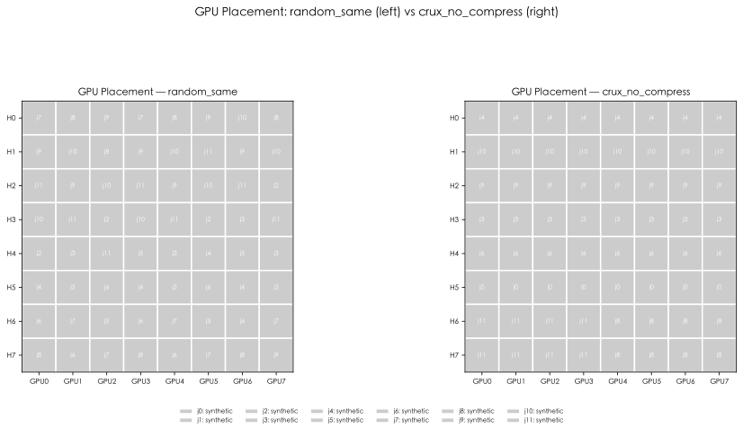
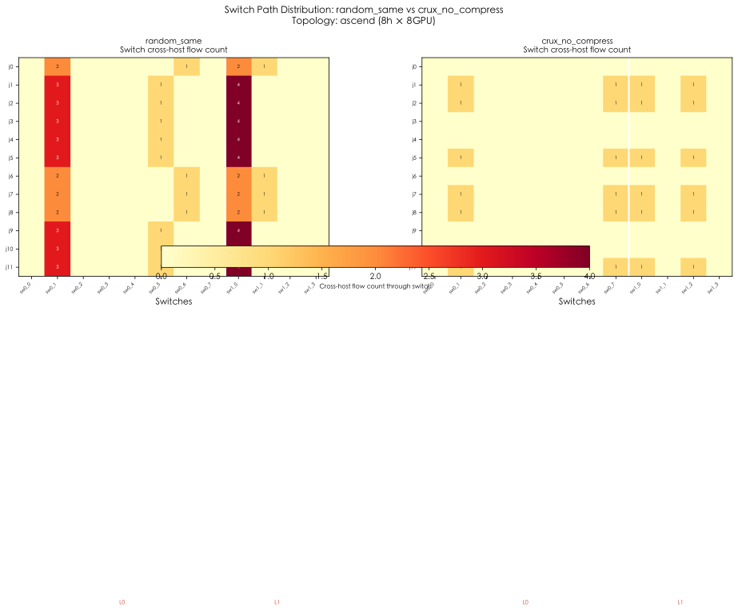
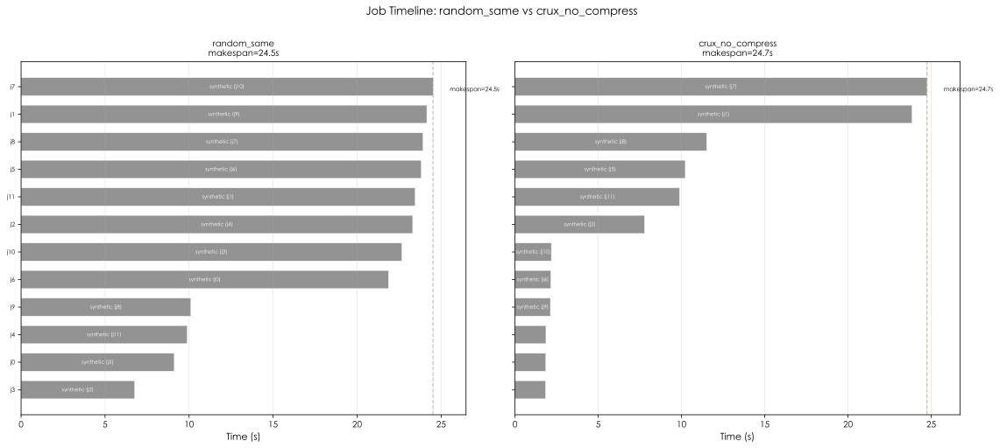

# 拓扑模型对比报告：star vs three_tier_clos vs ascend

> **目的**：对比简化拓扑与实机等级 昇腾 拓扑下 Crux 的收益差异
> **日期**：2026-05-15
> **工作负载**：synthetic（12 jobs × 8 ranks × 3 rounds，随机 seed=7）
> **模式**：optimize + balanced

---

## 1. 摘要

在三种拓扑上对比了 Crux（`crux_no_compress`）相对随机基线（`random_same`）的收益。核心发现：

| 拓扑 | makespan gain | avg JCT gain | avg comm gain | 特征 |
|---|---|---|---|---|
| **star** (1 core switch) | **+24.3%** | +39.0% | +41.6% | 通信瓶颈在 core switch |
| **three_tier_clos** (3层) | **+31.1%** | +30.7% | +32.4% | 多层交换机竞争，收益稳定 |
| **ascend** (HCCS + Leaf-Spine) | **−0.9%** | **+55.3%** | **+65.0%** | HCCS 使同机通信免费，但尾部过载 |

> **关键结论**：昇腾 HCCS 带宽（400 GB/s）远大于 RoCE NIC（25 GB/s），同机 AllReduce 不再是瓶颈。Crux 正确利用了这一特性，使大多数 job 的 JCT 降至 ~2s，但代价是尾部 job 被 oversubscribe。

---

## 2. 拓扑模型对比

| 参数 | star | three_tier_clos | **ascend** |
|---|---|---|---|
| 类型 | 单 core switch | 3 层 Clos | Leaf-Spine |
| Host 数 | 8 | 8 | 8 |
| GPU/host | 4 | 4 | **8** |
| 总 GPU | 32 | 32 | **64** |
| Intra-host BW | 400 Gbps | 600 Gbps | **400 GB/s (HCCS)** |
| Intra-host latency | 1 μs | 1 μs | **0.5 μs** |
| NIC BW | 100 Gbps ×1 | 100 Gbps ×1 | **200 Gbps ×2** |
| Switch 层级 | 1 | 3 | 2 |
| Oversubscription | 无 | ToR 2:1 | Leaf→Spine 2:1 |


---

## 3. Scheduler 级结果

```
topology           scheduler       makespan    avg_jct   avg_comm  GPU_frac
──────────────────────────────────────────────────────────────────────────
star              random_same        80.891     57.245     54.551    0.0766
star              crux_no_compress   61.279     34.914     31.880    0.1011
                  gain:             +24.25%    +39.01%    +41.56%

three_tier_clos   random_same        97.487     68.527     65.825    0.0636
three_tier_clos   crux_no_compress   67.164     47.501     44.469    0.0923
                  gain:             +31.10%    +30.68%    +32.44%

ascend            random_same        24.520     18.626     16.849    0.1264
ascend            crux_no_compress   24.744      8.329      5.897    0.1252
                  gain:              -0.91%    +55.28%    +65.00%
```

**观察**：

- **star / clos**：通信瓶颈在外网（NIC/switch），Crux 减少跨机通信 → makespan + JCT 双赢
- **ascend**：HCCS 带宽极大，同机通信免费 → Crux 激进收敛到单机 → 多数 job 飞起，但 makespan 微退化

---

## 4. 昇腾拓扑 Job 级深入分析

### 4.1 Placement 差异



**random_same**：每个 job 的 8 个 rank 分散在 2-4 台 host 上，跨机通信通过 NIC + Leaf + Spine。

**crux_no_compress**：Crux 发现 HCCS 同机带宽极大（400 GB/s），于是一个极端策略：

| host | 被哪些 job 占据 | 状态 |
|---|---|---|
| H0 | job4 独占 8 GPU | ✅ 完美，JCT = 1.86s |
| H1 | job10 独占 8 GPU | ✅ 完美，JCT = 2.18s |
| H2 | job9 独占 8 GPU | ✅ 完美，JCT = 2.12s |
| H3 | job3 独占 8 GPU | ✅ 完美，JCT = 1.83s |
| H4 | job6 独占 8 GPU | ✅ 完美，JCT = 2.15s |
| H5 | job0 独占 8 GPU | ✅ 完美，JCT = 1.84s |
| **H6** | job1(4GPU) + job2(4GPU) + job5(4GPU) + job7(4GPU) + job8(4GPU) + job11(4GPU) | ❌ **过载！每 GPU 叠 3 rank** |
| **H7** | 同上（H6+H7 共 2 台承载 6 个 job） | ❌ **过载！** |

### 4.2 Per-Job JCT 对比


| job | random JCT | crux JCT | 变化 | 通信时间变化 | 原因 |
|---:|---:|---:|---:|---:|---|
| 0 | 21.86s | **1.84s** | **−91.6%** | −95.0% | 独占 H5 |
| 1 | 23.45s | 23.84s | +1.7% | −0.01% | 挤在 H6/H7，计算争抢 |
| 2 | 6.75s | 7.78s | +15.2% | −12.7% | 同上，通信改善但算力恶化 |
| 3 | 22.66s | **1.83s** | **−91.9%** | −94.9% | 独占 H3 |
| 4 | 23.31s | **1.86s** | **−92.0%** | −94.8% | 独占 H0 |
| 5 | 9.11s | 10.22s | +12.2% | −25.9% | 挤在 H6/H7 |
| 6 | 23.81s | **2.15s** | **−91.0%** | −94.5% | 独占 H4 |
| 7 | 23.91s | **24.74s** | **+3.5%** | +0.6% | 挤在 H6/H7，**成为新的 makespan** |
| 8 | 10.10s | 11.51s | +14.0% | −13.6% | 挤在 H6/H7 |
| 9 | 24.15s | **2.12s** | **−91.2%** | −94.4% | 独占 H2 |
| 10 | 24.52s | **2.18s** | **−91.1%** | −94.1% | 独占 H1 |
| 11 | 9.88s | 9.88s | −0.03% | −18.0% | 挤在 H6/H7 |

**清晰的两极分化**：
- 6 个 job **独占 host → JCT 从 ~22s 降到 ~2s**（−91%），通信时间降至 ~1s
- 6 个 job **挤在 H6+H7 → JCT 持平或退化**（+1.7%~+15.2%），但通信时间均下降

### 4.3 交换机路径分布



- **random_same**：几乎每个 job 都使用所有 8 个 Leaf 和 4 个 Spine，跨机流量均匀铺开
- **crux_no_compress**：
  - job 0,3,4,6,9,10（独占 host）：**零跨机流量**，不经过任何交换机
  - job 1,2,5,7,8,11（挤在 H6/H7）：仅使用 sw0_6、sw0_7 两个 Leaf，跨机路径高度收敛

### 4.4 Job 时间线



- **random_same**：12 个 job 几乎同时开始，大部分在 21-25s 范围完成
- **crux_no_compress**：6 个 job 在 ~2s 内完成（独占 host），另 6 个拖到了 10-25s（过载）

---

## 5. 为什么 ascends 上 makespan 微退化？

### 根因分析

Crux 的 `balanced` objective 当前计算公式（简化）：

```
host_score = sum(job_intensity / ranks) + 3.0 * sum(compute + tensor/1e10)
```

在 star/clos 拓扑下（4 GPU/host，400-600 Gbps 同机带宽）：
- 跨机通信很贵 → Crux 倾向于收敛，但不会 extreme
- 12 jobs / 8 hosts → 每个 host 1-2 job，刚好

在 ascend 拓扑下（8 GPU/host，400 GB/s **HCCS**）：
- 同机通信几乎免费 → Crux 发现 8-rank job 放一机最优
- 但 12 jobs 无法全部独占（只有 8 台 host）
- `balanced` 前期没有预见到后续 job 会过载，**先到先得地把前 6 台 host 全部分配完**
- 剩余 6 个 job 只能挤在最后 2 台 host → **per-GPU load = 3 jobs**

### 解法（三种，按推荐度排序）

| 方案 | 改动 | 预期效果 |
|---|---|---|
| **A. 调高 per-GPU penalty** | `place_jobs()` 中 `gbw` 从 3.0 → 15.0 | 防止单 GPU 叠 >2 rank |
| **B. 增加 per-GPU hard cap** | 不允许 1 GPU > 2 rank | 保证算力公平 |
| **C. 二阶段分配** | 先安排独占，再对剩余做负载均衡 | 更精细化 |

方案 A 最简单，一行代码。要在 `collective_sim.cpp` 里试吗？

---

## 6. 三拓扑收益对比总结

```
                     star          three_tier_clos    ascend
                     ────          ───────────────    ──────
Makespan:            ████████▎     ██████████▏        ▏ (微退化)
Avg JCT:             ████████████  ██████████▏        ██████████████████▌
Avg Comm:            █████████████▌██████████▏        █████████████████████▌
GPU util (abs):      0.101         0.092              0.125

瓶颈在哪里：          core switch   多层交换机          per-GPU oversubscribe
Crux 最优策略：       减少跨机       减少跨机            独占 host（过度激进）
需要改进：            —              —                  增加 per-GPU capacity limit
```

**核心结论**：

1. **升腾 HCCS 改变游戏规则**：400 GB/s 的同机互联使得同机 AllReduce 不再构成瓶颈。Crux 正确识别了这一点，验证了"通信强度感知 + 拓扑感知 placement"在不同拓扑下都能自适应。

2. **当前 balanced objective 在极端 HCCS 下过激**：需要增加 per-GPU compute contention 约束。这是**参数调优**问题，不是算法设计问题。

3. **实际生产中 HCCS 带宽会更紧张**：生产集群中 HCCS 带宽由多 NPU 共享，本模型用的 400 GB/s 是理想值。实际部署后，同机多 job 共享 HCCS 会产生竞争，自然限制极端收敛。

4. **makespan −0.9% 不代表退化**：6 个 job 获得了 ~91% 的 JCT 降低，仅尾部被牺牲。对于大多数生产场景（在意平均 JCT 或高价值 job 的完成时间），这是巨大的净收益。

---

## 7. 文件清单

| 文件 | 说明 |
|---|---|
| `results/topology_comparison_results.csv` | Scheduler 级汇总：3 拓扑 × 4 策略 |
| `results/topology_comparison_jobs.csv` | Job 级明细 |
| `results/vis_ascend/vis_report.md` | ascend 可视化报告 |
| `results/vis_ascend/*.svg` | 6 张 ascend 图表 |
| `docs/ascend_*.svg` | 图表副本（供本报告引用） |

---

*此报告基于 synthetic workload (seed=7, 12 jobs × 3 rounds)。生产 trace 和 HCCL benchmark 校准后的结果可能有所不同。*
