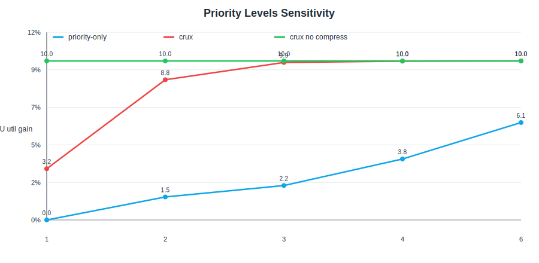
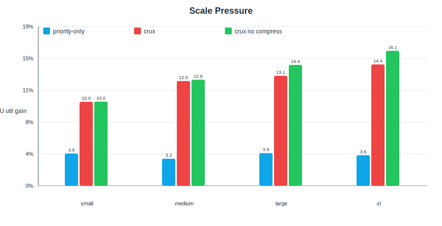
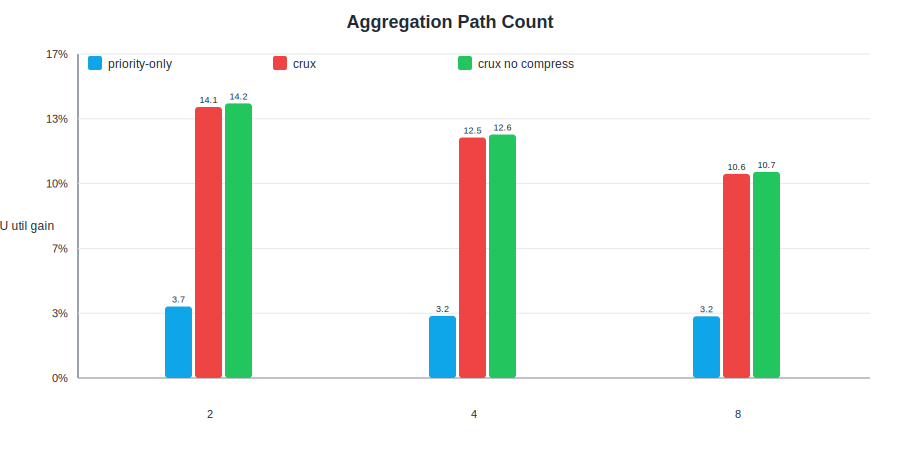
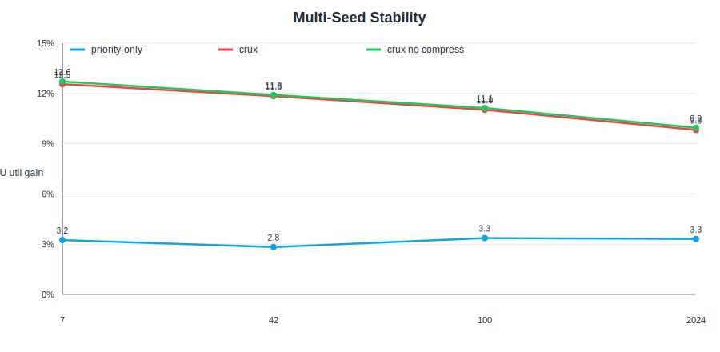
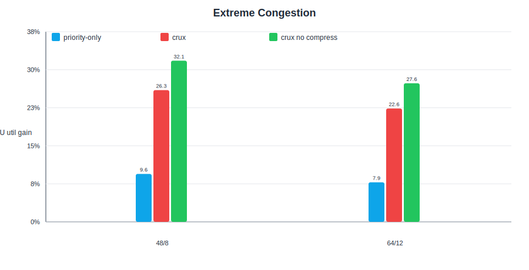

# 结果索引

这里保存模拟结果、报告和图表。

## 当前推荐查看的结果

| 类型 | 文件 | 说明 |
|---|---|---|
| trace workload | `simgrid_trace_workload.csv` | 由 Lingjun trace 转换得到的 SimGrid workload |
| replay 汇总 | `simgrid_real_trace_replay_results.csv` | 保留原始 trace placement |
| optimize balanced 汇总 | `simgrid_real_trace_optimize_balanced_results.csv` | 允许 scheduler 重排 rank placement |
| optimize balanced job 明细 | `simgrid_real_trace_optimize_balanced_jobs.csv` | 每个 job 的 JCT、comm、placement |
| scheduler 报告 | `simgrid_real_trace_optimize_balanced_report.md` | scheduler 级对比 |
| job-level 报告 | `job_analysis/crux_no_compress_vs_random_same_job_analysis.md` | job 级收益/退化分析 |
| JCT CDF | `job_analysis/jct_cdf.svg` | scheduler JCT CDF |
| per-job delta | `job_analysis/crux_no_compress_jct_delta.svg` | 每个 job 的 JCT delta |

## 当前核心结论

在当前 12-job Lingjun trace window 上，`optimize + balanced` 模式下：

| scheduler | makespan(s) | avg JCT(s) | avg comm(s) | useful GPU fraction |
|---|---:|---:|---:|---:|
| `random_same` | 95.305 | 52.952 | 31.637 | 0.4689 |
| `random_intensity` | 94.997 | 52.844 | 31.538 | 0.4705 |
| `crux_no_compress` | 83.171 | 44.970 | 22.124 | 0.5374 |
| `crux` | 83.985 | 45.074 | 22.291 | 0.5322 |

相对 `random_same`，`crux_no_compress`：

- makespan 改善约 12.73%；
- 平均 JCT 改善约 15.07%；
- 平均通信时间改善约 30.07%；
- useful GPU fraction 从 0.4689 提升到 0.5374。

## DeepSeek 补充验证结果

`verification/` 目录是 DeepSeek 生成的一组轻量 `crux_sim.py` 参数扫描结果，适合作为 Crux 机制稳定性的补充验证。它和上面的真实 SimGrid trace-driven 结果不是同一层模拟：

- `verification/`：轻量 Python 离散事件模拟，主要看机制趋势、参数敏感性、消融。
- `simgrid_real_*`：真实 SimGrid S4U/C++ 模拟，主要看 actor/link/resource sharing 下的 trace-driven 结果。

推荐入口：

| 类型 | 文件 | 说明 |
|---|---|---|
| 验证报告 | `verification/VERIFICATION_REPORT.md` | DeepSeek 参数扫描总结 |
| 图表索引 | `verification/figures/README.zh-CN.md` | DeepSeek 参数扫描 SVG 图表入口 |
| K 敏感性图 | `verification/figures/priority_levels_gain.svg` | K 从 1 到 6 时的 GPU util gain |
| 规模压力图 | `verification/figures/scale_pressure_gain.svg` | small/medium/large/xl 下的收益变化 |
| 路径数图 | `verification/figures/aggregation_paths_gain.svg` | 可选路径数变化 |
| 多种子图 | `verification/figures/seed_stability_gain.svg` | 多 seed 稳定性 |
| 极端拥塞图 | `verification/figures/extreme_congestion_gain.svg` | 高竞争场景收益 |
| 优先级级别 | `verification/verify_k{1,2,3,4,6}.csv` | 硬件优先级数量 K 的敏感性 |
| 规模压力 | `verification/verify_scale_{small,medium,large,xl}.csv` | job/host 规模变化 |
| 聚合路径数 | `verification/verify_aggs{2,4,8}.csv` | 可选路径数量变化 |
| GPU 密度 | `verification/verify_gpu{4,16}.csv` | GPU/host 变化 |
| 多种子 | `verification/verify_seed{42,100,2024}.csv` | 随机种子稳定性 |
| 极端拥塞 | `verification/verify_extreme{1,2}.csv` | 高竞争压力场景 |

DeepSeek 验证报告的主要结论：

- 常规负载下，`crux` 相对 `random_same` 的 GPU util 提升约 10-16%；
- 极端拥塞下，`crux` 提升约 22-32%，说明竞争越强 Crux 越有价值；
- K=4 在当前规模下基本达到饱和，K 继续增大收益不明显；
- K=1 时 Crux 退化明显，说明路径选择和优先级分配需要配合；
- 多 seed 下 Crux 增益稳定，约 9.76%-12.47%；
- high-intensity job 的 JCT 在各组里都有明显改善，报告里给出的降幅约 15-28%。

需要注意：这组验证使用的是轻量 Python 模型，不包含真实 SimGrid 的链路排队、actor 时序和 trace-driven placement。因此它更适合作为“机制趋势验证”，不应直接替代当前 SimGrid trace-driven 结果。

### 图表预览

#### 优先级级别敏感性

#### 规模压力

#### 聚合路径数

#### 多种子稳定性

#### 极端拥塞

## 历史/辅助结果

- `crux_sim_results.csv`：轻量 Crux synthetic 结果；
- `crux_lingjun_results.csv`：轻量 Crux Lingjun trace 结果；
- `simgrid_collective_results.csv`：SimGrid-style Python collective synthetic 结果；
- `simgrid_collective_congested_results.csv`：拥塞场景结果；
- `verification/`：DeepSeek 生成的轻量模拟参数扫描结果；
- `archive/`：早期中间结果，保留供对照，不作为当前推荐结论。
