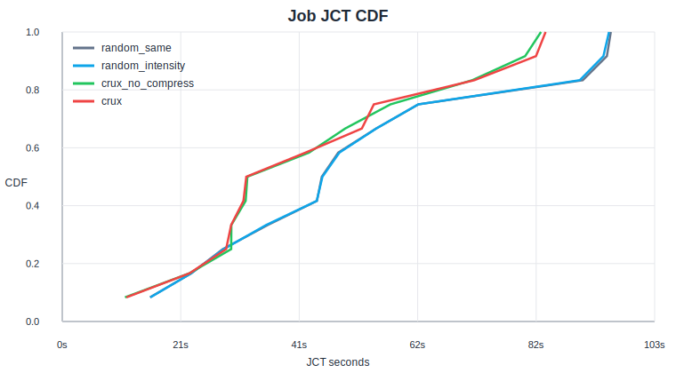
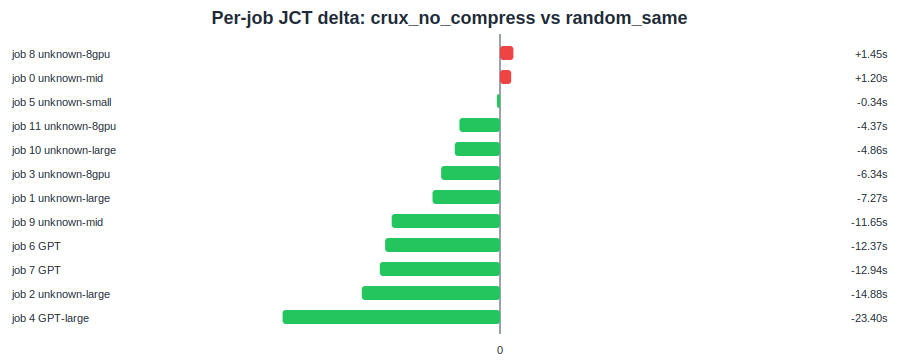

# SimGrid Job-Level Analysis

- job 输入：`crux_repro/results/simgrid_real_trace_optimize_balanced_jobs.csv`
- baseline：`random_same`
- target：`crux_no_compress`
- job delta CSV：`crux_repro/results/job_analysis/crux_no_compress_vs_random_same_job_deltas.csv`

## Summary

- 改善 job 数：10 / 12
- 退化 job 数：2 / 12

## Top JCT Gains

| job | model | JCT delta | JCT gain | comm delta | comm gain |
|---:|---|---:|---:|---:|---:|
| 4 | GPT-large | -23.404s | +24.73% | -29.138s | +47.53% |
| 2 | unknown-large | -14.878s | +15.61% | -20.923s | +33.99% |
| 7 | GPT | -12.944s | +28.70% | -13.948s | +39.45% |
| 6 | GPT | -12.371s | +27.96% | -9.645s | +30.29% |
| 9 | unknown-mid | -11.655s | +21.37% | -6.619s | +19.99% |

## Top JCT Regressions

| job | model | JCT delta | JCT gain | comm delta | comm gain |
|---:|---|---:|---:|---:|---:|
| 8 | unknown-8gpu | +1.447s | -5.19% | -4.882s | +25.33% |
| 0 | unknown-mid | +1.201s | -2.51% | -5.023s | +18.47% |
| 5 | unknown-small | -0.338s | +1.51% | -0.375s | +41.16% |
| 11 | unknown-8gpu | -4.366s | +28.61% | -2.801s | +34.57% |
| 10 | unknown-large | -4.861s | +7.86% | +1.380s | -5.54% |
