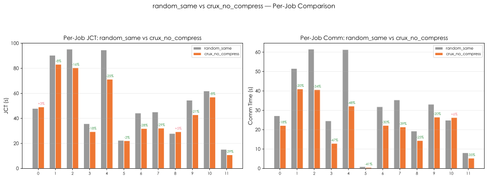
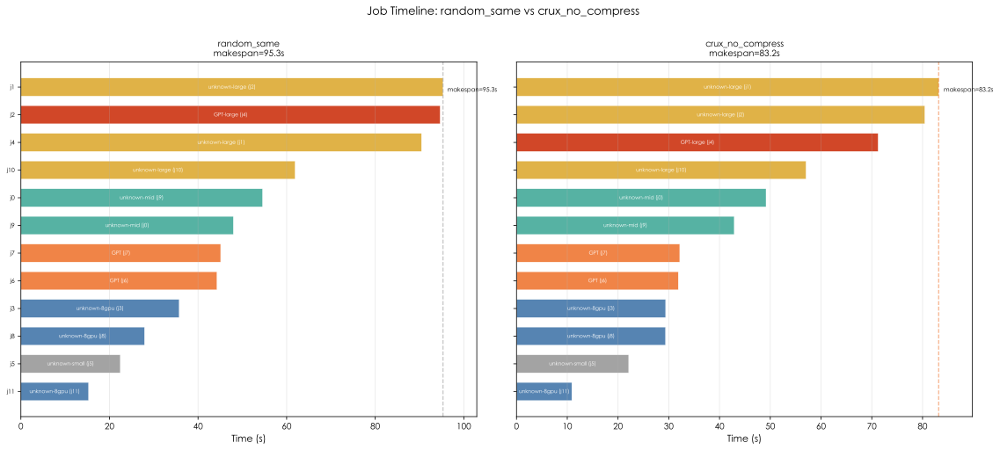
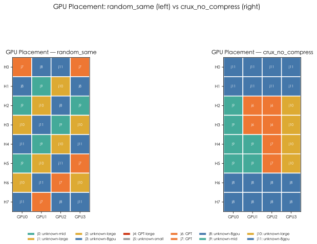

# Crux/SimGrid Visualization Report

**Baseline**: `random_same` | **Crux**: `crux_no_compress`

## 1. Scheduler Comparison

| Scheduler | Makespan (s) | Avg JCT (s) | Avg Comm (s) | Useful GPU Fraction |
|---:|---:|---:|---:|---:|
| `random_same` | 95.305 | 52.952 | 31.637 | 0.4689 |
| `random_intensity` | 94.997 | 52.844 | 31.538 | 0.4705 |
| `crux_no_compress` | 83.171 | 44.970 | 22.124 | 0.5374 |
| `crux` | 83.985 | 45.074 | 22.291 | 0.5322 |

### Gains vs baseline

- Makespan: **+12.73%**
- Avg JCT: **+15.07%**
- Avg Comm: **+30.07%**

## 2. Charts

### Communication Intensity

### Per-Job JCT & Comm Comparison

### Job Timeline (Gantt)

### GPU Placement

### Network Topology

### Switch Path Distribution

---

*Generated by vis/vis_main.py — Crux/SimGrid Visualization Phase 1*