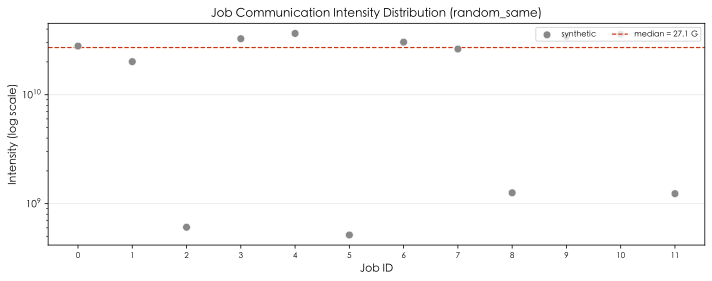
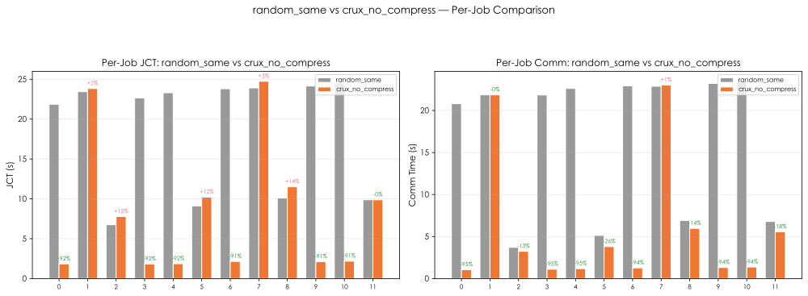
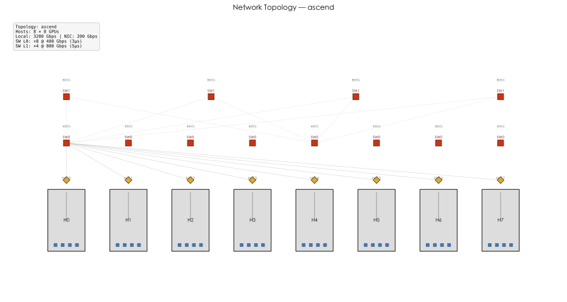

# Crux/SimGrid Visualization Report

**Baseline**: `random_same` | **Crux**: `crux_no_compress`

## 1. Scheduler Comparison

| Scheduler | Makespan (s) | Avg JCT (s) | Avg Comm (s) | Useful GPU Fraction |
|---:|---:|---:|---:|---:|
| `random_same` | 24.520 | 18.626 | 16.849 | 0.1264 |
| `random_intensity` | 24.522 | 18.587 | 16.813 | 0.1264 |
| `crux_no_compress` | 24.744 | 8.329 | 5.897 | 0.1252 |
| `crux` | 24.744 | 8.329 | 5.897 | 0.1252 |

### Gains vs baseline

- Makespan: **-0.91%**
- Avg JCT: **+55.28%**
- Avg Comm: **+65.00%**

## 2. Charts

### Communication Intensity

### Per-Job JCT & Comm Comparison

### Job Timeline (Gantt)

### GPU Placement

### Network Topology

### Switch Path Distribution

---

*Generated by vis/vis_main.py — Crux/SimGrid Visualization Phase 1*